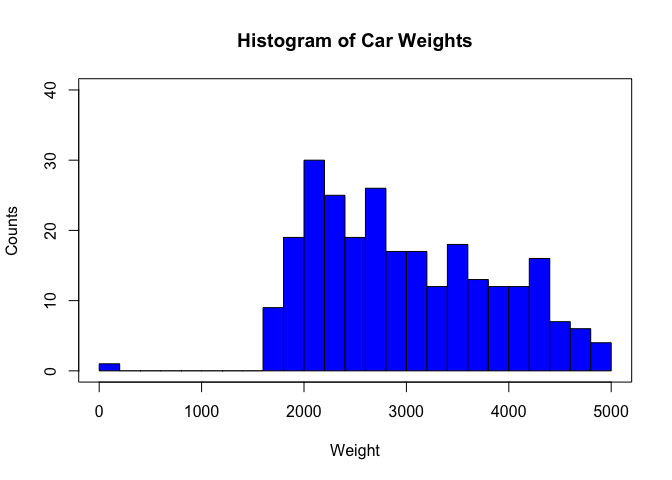
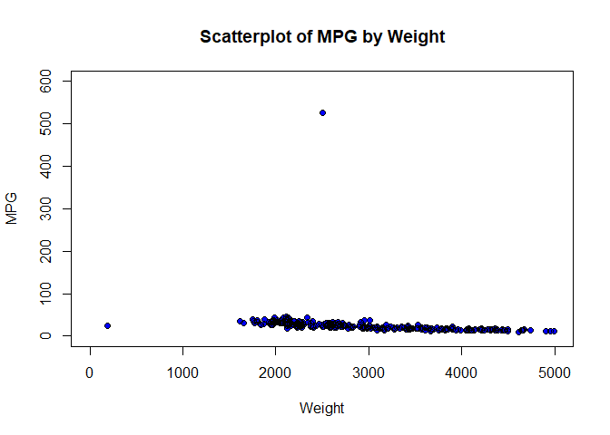
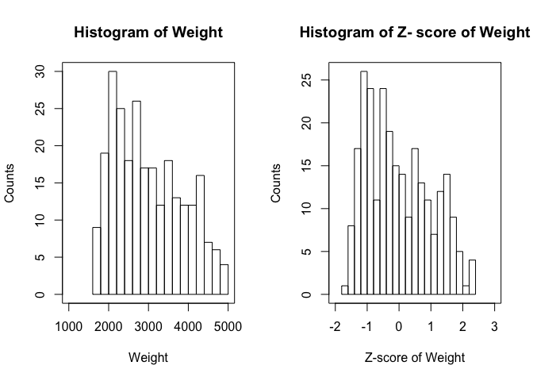
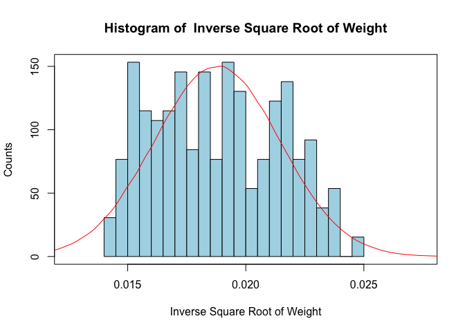

# Chapter 1

### GETTING STARTED WITH R
##### hello world
### Comments, indents, and semicolons

```r
  # Anything prefaced by a pound sign (#) is a comment.
  # Comments are not executed by R. Instead, they explain what the code is doing.
  # Indented code (that is not a comment) will run in R as if it was on one line
  # Code separated by semicolons will run as if the code was on separate lines,
  # with the semicolon marking the line break
```

### Open a dataset and display the data


```r
  head(cars) # Display the first few records of a dataset
```

```
##    mpg cylinders cubicinches  hp weightlbs time.to.60 year    brand
## 1 14.0         8         350 165      4209         12 1972      US.
## 2 31.9         4          89  71      1925         14 1980  Europe.
## 3 17.0         8         302 140      3449         11 1971      US.
## 4 15.0         8         400 150      3761         10 1971      US.
## 5 30.5         4          98  63      2051         17 1978      US.
## 6 23.0         8         350 125      3900         17 1980      US.
```


```r
  names(cars) # Display variable names of a data frame, one kind of data in R
```

```
## [1] "mpg"         "cylinders"   "cubicinches" "hp"          "weightlbs"  
## [6] "time.to.60"  "year"        "brand"
```


```r
  cars$weight # Look at only the weight variable within data frame cars
```

```
##   [1] 4209 1925 3449 3761 2051 3900 4363 4312 3530 2050 2245 2188 4141 3664
##  [15] 3381 4360 2020 3433 2278 2430 2019 2600 3012 4054 1968 1795 1773 4657
##  [29] 3574 2380 2130 3278 2506 2648 1985 3415 1835 2720 3955 3265 3897 4638
##  [43] 3645 3520 3086 2635 3755 2395 1940 3060 4464 3190 3609 2158 4380 4278
##  [57] 2930 2075 1937 3821 2945 2379 2910 2110 4237 3525 1950 1965 1825 3880
##  [71] 3102 2640 2288 2545 2219 3015 3085 2515 2265 2350 4325 4952 3425 2694
##  [85] 2220 1613 2774 3465 2125 2720 1975 2300 4100 3329 2255 3907 4499 3139
##  [99] 3830 3781 4997 4906 2126 2200 2265 2635 2335 2065 2671 3504 2279 2933
## [113] 4335 1795 2130 3785 2740 3039 2045 4341 2202 1963 4668 2745 1834 2565
## [127] 4654 2230 2582 1800 2300 2678 4951 3672 4440 4190 1955 3169 2945 2979
## [141] 2700 2171 2665 1760 3605 2957 3360 2735 3693 3205 2542 2560 4425 3158
## [155] 2464 3302 2124 2135 2634 3410 3003 4080 2984 2904 2254 3365 3439 2585
## [169] 2807 2125 2290 2830 1867 2575 2226 2189 4385 3672 3570 2045 2990 2145
## [183] 4215 3436 2395 3070 3459 3940 4129 4735 2620 2670 4422 4082 4077 2144
## [197] 2490 1985 1937 1945 2246 2639 3420 3630 2401 3850 2110 3021 4098 2900
## [211] 2815 3445 1755 2074 3233 2615 1975 4215 2595 4295 3193 2795 4457 3820
## [225] 4042 2003 4615 1649 2587 2790 3563 2625 2592 4498 3150 2130 4096 2965
## [239] 1875 2220 4055 3121 4220 2672 4354 3399 3735 2085 2155 2525 2120 2660
## [253] 2950 3988 2725 2372 3840 1800 2835 3288 3353
```

### Matrices
Create a matrix with three rows, two columns, and every value equal to 0.0

```r
  mat <- matrix(0.0, nrow = 3, ncol = 2); mat
```

```
##      [,1] [,2]
## [1,]    0    0
## [2,]    0    0
## [3,]    0    0
```

```r
  colnames(mat) <- c("Var 1", "Var 2") # Give a matrix variable names
  colnames(mat) # Display variable names of a matrix
```

```
## [1] "Var 1" "Var 2"
```

### Subset data and declare new variables

```r
  cars.rsub <- cars[1:50,] # Subset the data by rows
  cars.csub <- cars[,1:3] # Subset by columns
  cars.rcsub <- cars[c(1,3,5), c(2,4)] # Subset by specific rows and columns
  cars.vsub <- cars[which(cars$mpg> 30),] # Subset by a logical condition
# To declare new variables, type the variable name, a left-arrow, then the value of the variable
  firstletter <- 'a'
  weight <- cars$weight
```

### Display more than one figure at a time

```r
  par(mfrow=c(1,1)) # plots one figure; the default setting
  par(mfrow=c(2,3)) # plots six figures: three in the top row, three in the bottom row
  # Plots will fill the plot space row by row
```
### Download and install an R Package

```r
  #install.packages("ggplot2")
  library(ggplot2)
```

```
## Warning: package 'ggplot2' was built under R version 3.5.2
```
  
# Chapter 2
  
### READ IN THE CARS AND CARS2 DATASETS

```r
  setwd("~/IMGT680")
  cars <- read.csv("cars.txt", stringsAsFactors = FALSE)
  cars2 <- read.csv("cars2.txt", stringsAsFactors = FALSE)
```
### MISSING DATA

```r
  # Look at four variables from cars
  cars.4var <- cars[, c(1, 3, 4, 8)]
  head(cars.4var)
```

```
##    mpg cubicinches  hp    brand
## 1 14.0         350 165      US.
## 2 31.9          89  71  Europe.
## 3 17.0         302 140      US.
## 4 15.0         400 150      US.
## 5 30.5          98  63      US.
## 6 23.0         350 125      US.
```

```r
  # Make certain entries missing
  cars.4var[2,2] <- cars.4var[4,4] <- NA
  head(cars.4var)
```

```
##    mpg cubicinches  hp    brand
## 1 14.0         350 165      US.
## 2 31.9          NA  71  Europe.
## 3 17.0         302 140      US.
## 4 15.0         400 150     <NA>
## 5 30.5          98  63      US.
## 6 23.0         350 125      US.
```

```r
  # Replace missing values with constants
  cars.4var[2,2] <- 0
  cars.4var[4,4] <- "Missing"
  head(cars.4var)
```

```
##    mpg cubicinches  hp    brand
## 1 14.0         350 165      US.
## 2 31.9           0  71  Europe.
## 3 17.0         302 140      US.
## 4 15.0         400 150  Missing
## 5 30.5          98  63      US.
## 6 23.0         350 125      US.
```

```r
  # Replace values with mean and mode
  cars.4var[2,2] <- mean(na.omit(cars.4var$cubicinches))
  our_table <- table(cars.4var$brand)
  our_mode <- names(our_table)[our_table == max(our_table)]
  cars.4var[4,4] <- our_mode
  head(cars.4var)
```

```
##    mpg cubicinches  hp    brand
## 1 14.0    350.0000 165      US.
## 2 31.9    200.7625  71  Europe.
## 3 17.0    302.0000 140      US.
## 4 15.0    400.0000 150      US.
## 5 30.5     98.0000  63      US.
## 6 23.0    350.0000 125      US.
```

```r
  # Generate random observations
  obs_brand <- sample(na.omit(cars.4var$brand), 1)
  obs_cubicinches <- sample(na.omit(cars.4var$cubicinches), 1)
  cars.4var[2,2] <- obs_cubicinches
  cars.4var[4,4] <- obs_brand
  head(cars.4var)
```

```
##    mpg cubicinches  hp    brand
## 1 14.0         350 165      US.
## 2 31.9         110  71  Europe.
## 3 17.0         302 140      US.
## 4 15.0         400 150      US.
## 5 30.5          98  63      US.
## 6 23.0         350 125      US.
```

### CREATE A HISTOGRAM

```r
  # Set up the plot area
  par(mfrow = c(1,1))
 
  # Create the histogram bars
  hist(cars2$weight,
       breaks = 30,
       xlim = c(0, 5000),
       col = "blue",
       border = "black",
       ylim = c(0, 40),
       xlab = "Weight",
       ylab = "Counts",
       main = "Histogram of Car Weights")


  # Make a box around the plot
  box(which = "plot", lty = "solid", col = "black")
```



### CREATE A SCATTERPLOT

```r
  plot(cars2$weight, cars2$mpg,
       xlim = c(0, 5000), ylim = c(0, 600),
       xlab = "Weight", ylab = "MPG",
       main = "Scatterplot of MPG by Weight",
       type = "p", pch = 16, col = "blue")
  #Add open black circles
  points(cars2$weight, cars2$mpg,
         type = "p", col = "black")
```


 
### DESCRIPTIVE STATISTICS

```r
  mean(cars$weight) # Mean
```

```
## [1] 3005.49
```

```r
  median(cars$weight) # Median
```

```
## [1] 2835
```

```r
  length(cars$weight) # Number of observations
```

```
## [1] 261
```

```r
  sd(cars$weight) # Standard deviation
```

```
## [1] 852.6456
```

```r
  summary(cars$weight) # Min, Q1, Median, Mean, Q3, Max
```

```
##    Min. 1st Qu.  Median    Mean 3rd Qu.    Max. 
##    1613    2246    2835    3005    3664    4997
```
 
### TRANSFORMATIONS

```r
  # Min-max normalization
  summary(cars$weight)
```

```
##    Min. 1st Qu.  Median    Mean 3rd Qu.    Max. 
##    1613    2246    2835    3005    3664    4997
```

```r
  mi <- min(cars$weight)
  ma <- max(cars$weight)
  minmax.weight <- (cars$weight - mi)/(ma - mi)
  minmax.weight
```

```
##   [1] 0.76713948 0.09219858 0.54255319 0.63475177 0.12943262 0.67582742
##   [7] 0.81264775 0.79757683 0.56648936 0.12913712 0.18676123 0.16991726
##  [13] 0.74704492 0.60608747 0.52245863 0.81176123 0.12027187 0.53782506
##  [19] 0.19651300 0.24143026 0.11997636 0.29166667 0.41341608 0.72133570
##  [25] 0.10490544 0.05378251 0.04728132 0.89952719 0.57949173 0.22665485
##  [31] 0.15277778 0.49202128 0.26388889 0.30585106 0.10992908 0.53250591
##  [37] 0.06560284 0.32712766 0.69208038 0.48817967 0.67494090 0.89391253
##  [43] 0.60047281 0.56353428 0.43528369 0.30200946 0.63297872 0.23108747
##  [49] 0.09663121 0.42760047 0.84249409 0.46601655 0.58983452 0.16105201
##  [55] 0.81767139 0.78752955 0.38918440 0.13652482 0.09574468 0.65248227
##  [61] 0.39361702 0.22635934 0.38327423 0.14686761 0.77541371 0.56501182
##  [67] 0.09958629 0.10401891 0.06264775 0.66991726 0.44001182 0.30348700
##  [73] 0.19946809 0.27541371 0.17907801 0.41430260 0.43498818 0.26654846
##  [79] 0.19267139 0.21778960 0.80141844 0.98670213 0.53546099 0.31944444
##  [85] 0.17937352 0.00000000 0.34308511 0.54728132 0.15130024 0.32712766
##  [91] 0.10697400 0.20301418 0.73492908 0.50709220 0.18971631 0.67789598
##  [97] 0.85283688 0.45094563 0.65514184 0.64066194 1.00000000 0.97310875
## [103] 0.15159574 0.17346336 0.19267139 0.30200946 0.21335697 0.13356974
## [109] 0.31264775 0.55880615 0.19680851 0.39007092 0.80437352 0.05378251
## [115] 0.15277778 0.64184397 0.33303783 0.42139480 0.12765957 0.80614657
## [121] 0.17405437 0.10342790 0.90277778 0.33451537 0.06530733 0.28132388
## [127] 0.89864066 0.18232861 0.28634752 0.05526005 0.20301418 0.31471631
## [133] 0.98640662 0.60845154 0.83540189 0.76152482 0.10106383 0.45981087
## [139] 0.39361702 0.40366430 0.32121749 0.16489362 0.31087470 0.04343972
## [145] 0.58865248 0.39716312 0.51625296 0.33156028 0.61465721 0.47044917
## [151] 0.27452719 0.27984634 0.83096927 0.45656028 0.25147754 0.49911348
## [157] 0.15100473 0.15425532 0.30171395 0.53102837 0.41075650 0.72901891
## [163] 0.40514184 0.38150118 0.18942080 0.51773050 0.53959811 0.28723404
## [169] 0.35283688 0.15130024 0.20005910 0.35963357 0.07505910 0.28427896
## [175] 0.18114657 0.17021277 0.81914894 0.60845154 0.57830969 0.12765957
## [181] 0.40691489 0.15721040 0.76891253 0.53871158 0.23108747 0.43055556
## [187] 0.54550827 0.68764775 0.74349882 0.92257683 0.29757683 0.31235225
## [193] 0.83008274 0.72960993 0.72813239 0.15691489 0.25916076 0.10992908
## [199] 0.09574468 0.09810875 0.18705674 0.30319149 0.53398345 0.59604019
## [205] 0.23286052 0.66105201 0.14686761 0.41607565 0.73433806 0.38031915
## [211] 0.35520095 0.54137116 0.04196217 0.13622931 0.47872340 0.29609929
## [217] 0.10697400 0.76891253 0.29018913 0.79255319 0.46690307 0.34929078
## [223] 0.84042553 0.65218676 0.71778960 0.11524823 0.88711584 0.01063830
## [229] 0.28782506 0.34781324 0.57624113 0.29905437 0.28930260 0.85254137
## [235] 0.45419622 0.15277778 0.73374704 0.39952719 0.07742317 0.17937352
## [241] 0.72163121 0.44562648 0.77039007 0.31294326 0.80998818 0.52777778
## [247] 0.62706856 0.13947991 0.16016548 0.26950355 0.14982270 0.30939716
## [253] 0.39509456 0.70183215 0.32860520 0.22429078 0.65809693 0.05526005
## [259] 0.36111111 0.49497636 0.51418440
```

```r
  # Z-score standarization
  m <- mean(cars$weight); s <- sd(cars$weight)
  z.weight <- (cars$weight - m)/s
  z.weight
```

```
##   [1]  1.411500375 -1.267221019  0.520157004  0.886076914 -1.119445671
##   [6]  1.049098925  1.592114690  1.532300858  0.615155442 -1.120618491
##  [11] -0.891918547 -0.958769300  1.331748600  0.772313352  0.440405229
##  [16]  1.588596229 -1.155803098  0.501391880 -0.853215480 -0.674946806
##  [21] -1.156975918 -0.475567367  0.007634565  1.229713240 -1.216789750
##  [26] -1.419687649 -1.445489694  1.936923836  0.666759532 -0.733587817
##  [31] -1.026792873  0.319604745 -0.585812469 -0.419271997 -1.196851806
##  [36]  0.480281116 -1.372774840 -0.334828940  1.113604038  0.304358082
##  [41]  1.045580465  1.914640252  0.750029768  0.603427240  0.094423262
##  [46] -0.434518660  0.879039993 -0.715995514 -1.249628716  0.063929936
##  [51]  1.710569532  0.216396565  0.707808240 -0.993953907  1.612052634
##  [56]  1.492424971 -0.088536693 -1.091297986 -1.253147177  0.956446128
##  [61] -0.070944390 -0.734760637 -0.111993098 -1.050249278  1.444339341
##  [66]  0.609291341 -1.237900514 -1.220308210 -1.384503042  1.025642521
##  [71]  0.113188386 -0.428654558 -0.841487278 -0.540072480 -0.922411873
##  [76]  0.011153026  0.093250442 -0.575257087 -0.868462143 -0.768772424
##  [81]  1.547547521  2.282905802  0.492009318 -0.365322266 -0.921239053
##  [86] -1.633140930 -0.271496648  0.538922127 -1.032656974 -0.334828940
##  [91] -1.208580008 -0.827413435  1.283662970  0.379418577 -0.880190345
##  [96]  1.057308667  1.751618240  0.156582734  0.967001510  0.909533319
## [101]  2.335682713  2.228956072 -1.031484154 -0.944695458 -0.868462143
## [106] -0.434518660 -0.786364727 -1.103026188 -0.392297131  0.584662116
## [111] -0.852042660 -0.085018232  1.559275723 -1.419687649 -1.026792873
## [116]  0.914224600 -0.311372536  0.039300711 -1.126482592  1.566312645
## [121] -0.942349817 -1.222653851  1.949824858 -0.305508435 -1.373947660
## [126] -0.516616075  1.933405375 -0.909510851 -0.496678131 -1.413823548
## [131] -0.827413435 -0.384087390  2.281732982  0.781695914  1.682421847
## [136]  1.389216791 -1.232036413  0.191767341 -0.070944390 -0.031068502
## [141] -0.358285345 -0.978707244 -0.399334053 -1.460736357  0.703116959
## [146] -0.056870547  0.415776004 -0.317236637  0.806325139  0.233988869
## [151] -0.543590941 -0.522480176  1.664829544  0.178866318 -0.635070918
## [156]  0.347752431 -1.033829795 -1.020928772 -0.435691480  0.474417015
## [161] -0.002920817  1.260206566 -0.025204401 -0.119030019 -0.881363165
## [166]  0.421640105  0.508428802 -0.493159671 -0.232793581 -1.032656974
## [171] -0.839141637 -0.205818716 -1.335244593 -0.504887873 -0.914202132
## [176] -0.957596480  1.617916735  0.781695914  0.662068251 -1.126482592
## [181] -0.018167480 -1.009200570  1.418537296  0.504910341 -0.715995514
## [186]  0.075658138  0.531885206  1.096011734  1.317674757  2.028403814
## [191] -0.452110963 -0.393469952  1.661311083  1.262552206  1.256688105
## [196] -1.010373390 -0.604577592 -1.196851806 -1.253147177 -1.243764615
## [201] -0.890745727 -0.429827379  0.486145217  0.732437465 -0.708958592
## [206]  0.990457914 -1.050249278  0.018189947  1.281317330 -0.123721300
## [211] -0.223411019  0.515465723 -1.466600458 -1.092470806  0.266827835
## [216] -0.457975064 -1.208580008  1.418537296 -0.481431469  1.512362914
## [221]  0.219915026 -0.246867424  1.702359791  0.955273307  1.215639397
## [226] -1.175741042  1.887665386 -1.590919402 -0.490814030 -0.252731525
## [231]  0.653858510 -0.446246862 -0.484949929  1.750445420  0.169483756
## [236] -1.026792873  1.278971690 -0.047487985 -1.325862031 -0.921239053
## [241]  1.230886060  0.135471970  1.424401398 -0.391124311  1.581559308
## [246]  0.461515993  0.855583588 -1.079569783 -0.997472368 -0.563528884
## [251] -1.038521076 -0.405198154 -0.065080289  1.152307105 -0.328964839
## [256] -0.742970379  0.978729712 -1.413823548 -0.199954614  0.331332948
## [261]  0.407566262
```

```r
  length(cars$weight)
```

```
## [1] 261
```

```r
  # Decimal scaling
  max(abs(cars$weight)) # 4 digits
```

```
## [1] 4997
```

```r
  d.weight <- cars$weight/(10^4); d.weight
```

```
##   [1] 0.4209 0.1925 0.3449 0.3761 0.2051 0.3900 0.4363 0.4312 0.3530 0.2050
##  [11] 0.2245 0.2188 0.4141 0.3664 0.3381 0.4360 0.2020 0.3433 0.2278 0.2430
##  [21] 0.2019 0.2600 0.3012 0.4054 0.1968 0.1795 0.1773 0.4657 0.3574 0.2380
##  [31] 0.2130 0.3278 0.2506 0.2648 0.1985 0.3415 0.1835 0.2720 0.3955 0.3265
##  [41] 0.3897 0.4638 0.3645 0.3520 0.3086 0.2635 0.3755 0.2395 0.1940 0.3060
##  [51] 0.4464 0.3190 0.3609 0.2158 0.4380 0.4278 0.2930 0.2075 0.1937 0.3821
##  [61] 0.2945 0.2379 0.2910 0.2110 0.4237 0.3525 0.1950 0.1965 0.1825 0.3880
##  [71] 0.3102 0.2640 0.2288 0.2545 0.2219 0.3015 0.3085 0.2515 0.2265 0.2350
##  [81] 0.4325 0.4952 0.3425 0.2694 0.2220 0.1613 0.2774 0.3465 0.2125 0.2720
##  [91] 0.1975 0.2300 0.4100 0.3329 0.2255 0.3907 0.4499 0.3139 0.3830 0.3781
## [101] 0.4997 0.4906 0.2126 0.2200 0.2265 0.2635 0.2335 0.2065 0.2671 0.3504
## [111] 0.2279 0.2933 0.4335 0.1795 0.2130 0.3785 0.2740 0.3039 0.2045 0.4341
## [121] 0.2202 0.1963 0.4668 0.2745 0.1834 0.2565 0.4654 0.2230 0.2582 0.1800
## [131] 0.2300 0.2678 0.4951 0.3672 0.4440 0.4190 0.1955 0.3169 0.2945 0.2979
## [141] 0.2700 0.2171 0.2665 0.1760 0.3605 0.2957 0.3360 0.2735 0.3693 0.3205
## [151] 0.2542 0.2560 0.4425 0.3158 0.2464 0.3302 0.2124 0.2135 0.2634 0.3410
## [161] 0.3003 0.4080 0.2984 0.2904 0.2254 0.3365 0.3439 0.2585 0.2807 0.2125
## [171] 0.2290 0.2830 0.1867 0.2575 0.2226 0.2189 0.4385 0.3672 0.3570 0.2045
## [181] 0.2990 0.2145 0.4215 0.3436 0.2395 0.3070 0.3459 0.3940 0.4129 0.4735
## [191] 0.2620 0.2670 0.4422 0.4082 0.4077 0.2144 0.2490 0.1985 0.1937 0.1945
## [201] 0.2246 0.2639 0.3420 0.3630 0.2401 0.3850 0.2110 0.3021 0.4098 0.2900
## [211] 0.2815 0.3445 0.1755 0.2074 0.3233 0.2615 0.1975 0.4215 0.2595 0.4295
## [221] 0.3193 0.2795 0.4457 0.3820 0.4042 0.2003 0.4615 0.1649 0.2587 0.2790
## [231] 0.3563 0.2625 0.2592 0.4498 0.3150 0.2130 0.4096 0.2965 0.1875 0.2220
## [241] 0.4055 0.3121 0.4220 0.2672 0.4354 0.3399 0.3735 0.2085 0.2155 0.2525
## [251] 0.2120 0.2660 0.2950 0.3988 0.2725 0.2372 0.3840 0.1800 0.2835 0.3288
## [261] 0.3353
```
  
### SIDE-BY-SIDE HISTOGRAMS

```r
  par(mfrow = c(1,2))
  
  # Create two histograms
  hist(cars$weight, breaks = 20, xlim = c(1000, 5000),
       main = "Histogram of Weight", xlab = "Weight", ylab = "Counts")
  box(which = "plot", lty = "solid", col = "black")
  hist(z.weight, breaks = 20, xlim = c(-2, 3),
       main = "Histogram of Z- score of Weight",
       xlab = "Z-score of Weight", ylab = "Counts")
  box(which = "plot", lty = "solid", col = "black")
```


  
### SKEWNESS

```r
  (3*(mean(cars$weight) - median(cars$weight)))/sd(cars$weight)
```

```
## [1] 0.5998638
```

```r
  (3*(mean(z.weight) - median(z.weight)))/sd(z.weight)
```

```
## [1] 0.5998638
```
 
### TRANSFORMATIONS FOR NORMALITY

```r
  sqrt.weight <- sqrt(cars$weight) # Square root
  sqrt.weight_skew <- (3*(mean(sqrt.weight) - median(sqrt.weight))) / sd(sqrt.weight)
  ln.weight <- log(cars$weight) # Natural log
  ln.weight_skew <- (3*(mean(ln.weight) - median(ln.weight))) / sd(ln.weight)
  invsqrt.weight <- 1 / sqrt(cars$weight) # Inverse square root
  invsqrt.weight_skew <- (3*(mean(invsqrt.weight) - median(invsqrt.weight))) /sd(invsqrt.weight)
```
 
### HISTOGRAM WITH NORMAL DISTRIBUTION OVERLAY

```r
  par(mfrow=c(1,1))
  x <- rnorm(1000000, mean = mean (invsqrt.weight),
             sd = sd(invsqrt.weight))
  hist(invsqrt.weight, breaks = 30, xlim = c(0.0125, 0.0275),
       col = "lightblue", prob = TRUE, border = "black",
       xlab = "Inverse Square Root of Weight",
       ylab = "Counts", main = "Histogram of  Inverse Square Root of Weight")
  box(which = "plot", lty = "solid", col="black")
  
  # Overlay with  Normal density
  lines(density(x), col = "red")
```


 
### NORMAL Q-Q PLOT

```r
  qqnorm(invsqrt.weight, datax = TRUE, col = "red", ylim = c(0.01, 0.03),
         main = "Normal Q-Q Plot of Inverse Square Root of Weight")
  qqline(invsqrt.weight, col = "blue", datax = TRUE)
```


  
### DE-TRANSFORM DATA

```r
  # Transform x using y = 1 / sqrt(x)
  x <- cars$weight[1]; y <- 1 / sqrt(x)
  
  # Detransform x using x = 1 / (y)^2
  detransformedx <- 1 / y^2
  x; y; detransformedx
```

```
## [1] 4209
```

```
## [1] 0.01541383
```

```
## [1] 4209
```
 
### CREATE INDICATOR VARIABLES

```r
  north_flag <- east_flag <- south_flag <- c(rep(NA, 10))
  region <- c(rep(c("north", "south", "east", "west"),2), "north", "south")
  
  # Change the region variable to indicators
  for (i in 1:length(region)) {
    if(region[i] == "north") north_flag[i] = 1
    else north_flag[i] = 0
    if(region[i] == "east") east_flag[i] = 1
    else east_flag[i] = 0
    if(region[i] == "south") south_flag[i] = 1
    else south_flag[i] = 0
  }
  north_flag; east_flag; south_flag
```

```
##  [1] 1 0 0 0 1 0 0 0 1 0
```

```
##  [1] 0 0 1 0 0 0 1 0 0 0
```

```
##  [1] 0 1 0 0 0 1 0 0 0 1
```

```r
### INDEX FIELDS
  # Data frames have an index field;
  # the left-most column
  cars
```

```
##      mpg cylinders cubicinches  hp weightlbs time.to.60 year    brand
## 1   14.0         8         350 165      4209         12 1972      US.
## 2   31.9         4          89  71      1925         14 1980  Europe.
## 3   17.0         8         302 140      3449         11 1971      US.
## 4   15.0         8         400 150      3761         10 1971      US.
## 5   30.5         4          98  63      2051         17 1978      US.
## 6   23.0         8         350 125      3900         17 1980      US.
## 7   13.0         8         351 158      4363         13 1974      US.
## 8   14.0         8         440 215      4312          9 1971      US.
## 9   25.4         5         183  77      3530         20 1980  Europe.
## 10  37.7         4          89  62      2050         17 1982   Japan.
## 11  34.0         4         108  70      2245         17 1983   Japan.
## 12  34.3         4          97  78      2188         16 1981  Europe.
## 13  16.0         8         302 140      4141         14 1975      US.
## 14  11.0         8         350 180      3664         11 1974      US.
## 15  19.1         6         225  90      3381         19 1981      US.
## 16  16.9         8         350 155      4360         15 1980      US.
## 17  31.8         4          85  65      2020         19 1980   Japan.
## 18  16.0         8         304 150      3433         12 1971      US.
## 19  24.0         4         113  95      2278         16 1973   Japan.
## 20  24.0         4         107  90      2430         15 1971  Europe.
## 21  37.2         4          86  65      2019         16 1981   Japan.
## 22  21.5         4         121 110      2600         13 1978  Europe.
## 23  24.0         6         200  81      3012         18 1977      US.
## 24  15.5         8         351 142      4054         14 1980      US.
## 25  38.1         4          89  60      1968         19 1981   Japan.
## 26  33.0         4          91  53      1795         17 1977   Japan.
## 27  31.0         4          71  65      1773         19 1972   Japan.
## 28  14.0         8         351 148      4657         14 1976      US.
## 29  18.0         6         250  78      3574         21 1977      US.
## 30  29.9         4          98  65      2380         21 1982      US.
## 31  27.0         4          97  88      2130         15 1971   Japan.
## 32  16.0         6         250 100      3278         18 1974      US.
## 33  23.0         4         120  97      2506         15 1973   Japan.
## 34  21.0         6         199  90      2648         15 1971      US.
## 35  30.0         4          97  67      1985         16 1978   Japan.
## 36  22.4         6         231 110      3415         16 1982      US.
## 37  26.0         4          97  46      1835         21 1971  Europe.
## 38  21.5         3          80 110      2720         14 1978   Japan.
## 39  16.5         8         351 138      3955         13 1980      US.
## 40  20.2         6         232  90      3265         18 1980      US.
## 41  16.0         6         250 105      3897         19 1976      US.
## 42  14.0         8         302 140      4638         16 1975      US.
## 43  18.5         6         250 110      3645         16 1977      US.
## 44  17.5         6         250 110      3520         16 1978      US.
## 45  14.0         8         455 225      3086         10 1971      US.
## 46  31.6         4         120  74      2635         18 1982   Japan.
## 47  13.0         8         318 150      3755         14 1977      US.
## 48  22.0         4         122  86      2395         16 1973      US.
## 49  29.0         4          97  78      1940         15 1978  Europe.
## 50  20.2         6         200  88      3060         17 1982      US.
## 51  13.0         8         400 150      4464         12 1974      US.
## 52  27.2         4         141  71      3190         25 1980  Europe.
## 53  14.0         8         340 160      3609          8 1971      US.
## 54  24.0         4         116  75      2158         16 1974  Europe.
## 55  16.5         8         350 180      4380         12 1977      US.
## 56  16.0         8         400 230      4278         10 1974      US.
## 57  19.0         6         156 108      2930         16 1977   Japan.
## 58  33.5         4          98  83      2075         16 1978      US.
## 59  29.0         4          90  70      1937         14 1977  Europe.
## 60  13.0         8         360 175      3821         11 1974      US.
## 61  18.0         6         232 100      2945         16 1974      US.
## 62  22.0         4         108  94      2379         17 1974   Japan.
## 63  32.7         6         168 132      2910         11 1981   Japan.
## 64  46.6         4          86  65      2110         18 1981   Japan.
## 65  14.0         8         318 150      4237         15 1974      US.
## 66  18.5         6         250  98      3525         19 1978      US.
## 67  26.0         4          97  46      1950         21 1974  Europe.
## 68  32.0         4          91  67      1965         16 1983   Japan.
## 69  29.5         4          97  71      1825         12 1977  Europe.
## 70  17.5         8         305 145      3880         13 1978      US.
## 71  20.0         6         198  95      3102         17 1975      US.
## 72  27.0         4         112  88      2640         19 1983      US.
## 73  28.0         4          97  92      2288         17 1973   Japan.
## 74  24.0         4         119  97      2545         17 1976   Japan.
## 75  29.0         4          98  83      2219         17 1975  Europe.
## 76  38.0         6         262  85      3015         17 1983      US.
## 77  22.5         6         232  90      3085         18 1977      US.
## 78  21.1         4         134  95      2515         15 1979   Japan.
## 79  26.0         4          98  90      2265         16 1974  Europe.
## 80  32.4         4         108  75      2350         17 1982   Japan.
## 81  15.5         8         400 190      4325         12 1978      US.
## 82  12.0         8         429 198      4952         12 1974      US.
## 83  19.2         8         305 145      3425         13 1979      US.
## 84  23.0         4         115  95      2694         15 1976  Europe.
## 85  25.0         4         116  81      2220         17 1977  Europe.
## 86  35.0         4          72  69      1613         18 1972   Japan.
## 87  18.0         6         199  97      2774         16 1971      US.
## 88  17.6         6         225  85      3465         17 1982      US.
## 89  28.0         4          90  75      2125         15 1975      US.
## 90  31.0         4         119  82      2720         19 1983      US.
## 91  34.1         4          86  65      1975         15 1980   Japan.
## 92  27.2         4         119  97      2300         15 1979   Japan.
## 93  13.0         8         350 175      4100         13 1974      US.
## 94  17.0         6         250 100      3329         16 1972      US.
## 95  26.0         4          98  79      2255         18 1977      US.
## 96  17.0         6         231 110      3907         21 1976      US.
## 97  12.0         8         350 180      4499         13 1974      US.
## 98  18.0         6         250  88      3139         15 1972      US.
## 99  18.2         8         318 135      3830         15 1980      US.
## 100 16.0         6         250 100      3781         17 1975      US.
## 101 11.0         8         400 150      4997         14 1974      US.
## 102 12.0         8         400 167      4906         13 1974      US.
## 103 25.0         4          98  80      2126         17 1973      US.
## 104 34.2         4         105  70      2200         13 1980      US.
## 105 32.2         4         108  75      2265         15 1981   Japan.
## 106 26.6         4         151  84      2635         16 1982      US.
## 107 43.4         4          90  48      2335         24 1981  Europe.
## 108 30.0         4          88  76      2065         15 1972  Europe.
## 109 25.0         4         121 115      2671         14 1976  Europe.
## 110 18.0         8         307 130      3504         12 1971      US.
## 111 20.0         4          97  88      2279         19 1974   Japan.
## 112 18.0         4         121 112      2933         15 1973  Europe.
## 113 16.0         8         351 149      4335         15 1978      US.
## 114 33.0         4          91  53      1795         18 1976   Japan.
## 115 37.3         4          91  69      2130         15 1980  Europe.
## 116 18.0         6         225  95      3785         19 1976      US.
## 117 24.5         4         151  88      2740         16 1978      US.
## 118 21.0         6         231 110      3039         15 1976      US.
## 119 34.4         4          98  65      2045         16 1982      US.
## 120 15.0         8         429 198      4341         10 1971      US.
## 121 27.0         4         101  83      2202         15 1977  Europe.
## 122 26.0         4          79  67      1963         16 1975  Europe.
## 123 16.0         8         400 170      4668         12 1976      US.
## 124 23.2         4         156 105      2745         17 1979      US.
## 125 27.0         4          97  60      1834         19 1972  Europe.
## 126 26.5         4         140  72      2565         14 1977      US.
## 127 13.0         8         360 170      4654         13 1974      US.
## 128 30.9         4         105  75      2230         15 1979      US.
## 129 20.0         4         114  91      2582         14 1974  Europe.
## 130 36.1         4          98  66      1800         14 1979      US.
## 131 26.0         4          97  78      2300         15 1975  Europe.
## 132 28.0         4         151  90      2678         17 1981      US.
## 133 12.0         8         455 225      4951         11 1974      US.
## 134 17.0         8         304 150      3672         12 1973      US.
## 135 15.0         8         350 145      4440         14 1976      US.
## 136 16.0         8         318 150      4190         13 1977      US.
## 137 26.0         4          91  70      1955         21 1972      US.
## 138 13.0         8         302 129      3169         12 1976      US.
## 139 22.0         4         121  98      2945         15 1976  Europe.
## 140 21.0         4         120  87      2979         20 1973  Europe.
## 141 26.8         6         173 115      2700         13 1980      US.
## 142 29.0         4          97  75      2171         16 1976   Japan.
## 143 32.0         4         144  96      2665         14 1983   Japan.
## 144 35.1         4          81  60      1760         16 1982   Japan.
## 145 19.2         8         267 125      3605         15 1980      US.
## 146 23.0         4         120  88      2957         17 1976  Europe.
## 147 20.6         6         225 110      3360         17 1980      US.
## 148 27.0         4         151  90      2735         18 1983      US.
## 149 15.0         8         350 165      3693         12 1971      US.
## 150 18.1         8         302 139      3205         11 1979      US.
## 151 31.3         4         120  75      2542         18 1981   Japan.
## 152 27.5         4         134  95      2560         14 1979   Japan.
## 153 14.0         8         455 225      4425         10 1971      US.
## 154 15.0         6         250  72      3158         20 1976      US.
## 155 28.0         4         107  86      2464         16 1977  Europe.
## 156 19.0         6         250  88      3302         16 1972      US.
## 157 18.0         3          70  90      2124         14 1974   Japan.
## 158 29.5         4          98  68      2135         17 1979   Japan.
## 159 19.0         6         232 100      2634         13 1972      US.
## 160 16.2         6         163 133      3410         16 1979  Europe.
## 161 24.3         4         151  90      3003         20 1981      US.
## 162 17.5         8         318 140      4080         14 1979      US.
## 163 18.0         6         171  97      2984         15 1976      US.
## 164 23.0         6         198  95      2904         16 1974      US.
## 165 23.0         4          97  54      2254         24 1973  Europe.
## 166 19.9         8         260 110      3365         16 1979      US.
## 167 16.0         6         225 105      3439         16 1972      US.
## 168 26.0         4         156  92      2585         15 1983      US.
## 169 20.0         6         156 122      2807         14 1974   Japan.
## 170 38.0         4         105  63      2125         15 1983      US.
## 171 32.4         4         107  72      2290         17 1981   Japan.
## 172 20.3         5         131 103      2830         16 1979  Europe.
## 173 29.0         4          68  49      1867         20 1974  Europe.
## 174 31.0         4         112  85      2575         16 1983      US.
## 175 21.0         4         122  86      2226         17 1973      US.
## 176 26.0         4          96  69      2189         18 1973  Europe.
## 177 14.0         8         400 175      4385         12 1973      US.
## 178 14.0         8         304 150      3672         12 1974      US.
## 179 20.2         8         302 139      3570         13 1979      US.
## 180 31.5         4          98  68      2045         19 1978   Japan.
## 181 19.8         6         200  85      2990         18 1980      US.
## 182 33.8         4          97  67      2145         18 1981   Japan.
## 183 17.5         8         305 140      4215         13 1977      US.
## 184 18.0         8         318 150      3436         11 1971      US.
## 185 34.0         4         112  88      2395         18 1983      US.
## 186 20.8         6         200  85      3070         17 1979      US.
## 187 18.0         6         250 105      3459         16 1976      US.
## 188 13.0         8         318 150      3940         13 1977      US.
## 189 14.0         8         351 153      4129         13 1973      US.
## 190 13.0         8         440 215      4735         11 1974      US.
## 191 25.8         4         156  92      2620         14 1982      US.
## 192 28.4         4         151  90      2670         16 1980      US.
## 193 13.0         8         400 190      4422         13 1973      US.
## 194 15.0         8         350 145      4082         13 1974      US.
## 195 14.0         8         318 150      4077         14 1973      US.
## 196 41.5         4          98  76      2144         15 1981  Europe.
## 197 27.2         4         135  84      2490         16 1982      US.
## 198 43.1         4          90  48      1985         22 1979  Europe.
## 199 29.0         4          90  70      1937         14 1976  Europe.
## 200 33.5         4          85  70      1945         17 1978   Japan.
## 201 26.0         4         116  75      2246         14 1975  Europe.
## 202 23.0         4         140  83      2639         17 1976      US.
## 203 23.9         8         260  90      3420         22 1980      US.
## 204 19.0         6         225 100      3630         18 1978      US.
## 205 21.0         4         140  72      2401         20 1974      US.
## 206 15.0         8         390 190      3850          9 1971      US.
## 207 40.8         4          85  65      2110         19 1981   Japan.
## 208 18.0         6         250  88      3021         17 1974      US.
## 209 13.0         8         307 130      4098         14 1973      US.
## 210 25.4         6         168 116      2900         13 1982   Japan.
## 211 22.0         6         146  97      2815         15 1978   Japan.
## 212 17.7         6         231 165      3445         13 1979      US.
## 213 39.1         4          79  58      1755         17 1982   Japan.
## 214 30.0         4          79  70      2074         20 1972  Europe.
## 215 22.0         6         225 100      3233         15 1977      US.
## 216 32.9         4         119 100      2615         15 1982   Japan.
## 217 37.0         4          85  65      1975         19 1982   Japan.
## 218 14.5         8         351 152      4215         13 1977      US.
## 219 28.8         6         173 115      2595         11 1980      US.
## 220 15.0         8         302 130      4295         15 1978      US.
## 221 17.5         6         258  95      3193         18 1977      US.
## 222 21.6         4         121 115      2795         16 1979  Europe.
## 223 14.0         8         318 150      4457         14 1975      US.
## 224 16.5         6         168 120      3820         17 1977  Europe.
## 225 14.0         8         302 137      4042         15 1974      US.
## 226 32.0         4          83  61      2003         19 1975   Japan.
## 227 10.0         8         360 215      4615         14 1971      US.
## 228 31.0         4          76  52      1649         17 1975   Japan.
## 229 21.0         6         200  85      2587         16 1971      US.
## 230 27.0         4         140  86      2790         16 1983      US.
## 231 15.0         8         383 170      3563         10 1971      US.
## 232 28.0         4         120  79      2625         19 1983      US.
## 233 23.0         4         140  78      2592         19 1976      US.
## 234 16.0         8         318 150      4498         15 1976      US.
## 235 20.0         4         130 102      3150         16 1977  Europe.
## 236 44.0         4          97  52      2130         25 1983  Europe.
## 237 14.0         8         318 150      4096         13 1972      US.
## 238 20.2         6         200  85      2965         16 1979      US.
## 239 39.0         4          86  64      1875         16 1982      US.
## 240 23.0         4         122  86      2220         14 1972      US.
## 241 13.0         8         350 145      4055         12 1977      US.
## 242 18.0         6         225 105      3121         17 1974      US.
## 243 16.0         8         400 180      4220         11 1978      US.
## 244 25.0         4         110  87      2672         18 1971  Europe.
## 245 14.0         8         454 220      4354          9 1971      US.
## 246 15.0         8         318 150      3399         11 1974      US.
## 247 19.4         8         318 140      3735         13 1979      US.
## 248 44.3         4          90  48      2085         22 1981  Europe.
## 249 28.0         4          97  75      2155         16 1977   Japan.
## 250 29.0         4         135  84      2525         16 1983      US.
## 251 32.1         4          98  70      2120         16 1981      US.
## 252 24.0         4         121 110      2660         14 1974  Europe.
## 253 36.4         5         121  67      2950         20 1981  Europe.
## 254 13.0         8         350 145      3988         13 1974      US.
## 255 23.5         6         173 110      2725         13 1982      US.
## 256 24.0         4         113  95      2372         15 1971   Japan.
## 257 17.0         8         305 130      3840         15 1980      US.
## 258 36.1         4          91  60      1800         16 1979   Japan.
## 259 22.0         6         232 112      2835         15 1983      US.
## 260 18.0         6         232 100      3288         16 1972      US.
## 261 22.0         6         250 105      3353         15 1977      US.
```

```r
  cars[order(cars$mpg),]
```

```
##      mpg cylinders cubicinches  hp weightlbs time.to.60 year    brand
## 227 10.0         8         360 215      4615         14 1971      US.
## 14  11.0         8         350 180      3664         11 1974      US.
## 101 11.0         8         400 150      4997         14 1974      US.
## 82  12.0         8         429 198      4952         12 1974      US.
## 97  12.0         8         350 180      4499         13 1974      US.
## 102 12.0         8         400 167      4906         13 1974      US.
## 133 12.0         8         455 225      4951         11 1974      US.
## 7   13.0         8         351 158      4363         13 1974      US.
## 47  13.0         8         318 150      3755         14 1977      US.
## 51  13.0         8         400 150      4464         12 1974      US.
## 60  13.0         8         360 175      3821         11 1974      US.
## 93  13.0         8         350 175      4100         13 1974      US.
## 127 13.0         8         360 170      4654         13 1974      US.
## 138 13.0         8         302 129      3169         12 1976      US.
## 188 13.0         8         318 150      3940         13 1977      US.
## 190 13.0         8         440 215      4735         11 1974      US.
## 193 13.0         8         400 190      4422         13 1973      US.
## 209 13.0         8         307 130      4098         14 1973      US.
## 241 13.0         8         350 145      4055         12 1977      US.
## 254 13.0         8         350 145      3988         13 1974      US.
## 1   14.0         8         350 165      4209         12 1972      US.
## 8   14.0         8         440 215      4312          9 1971      US.
## 28  14.0         8         351 148      4657         14 1976      US.
## 42  14.0         8         302 140      4638         16 1975      US.
## 45  14.0         8         455 225      3086         10 1971      US.
## 53  14.0         8         340 160      3609          8 1971      US.
## 65  14.0         8         318 150      4237         15 1974      US.
## 153 14.0         8         455 225      4425         10 1971      US.
## 177 14.0         8         400 175      4385         12 1973      US.
## 178 14.0         8         304 150      3672         12 1974      US.
## 189 14.0         8         351 153      4129         13 1973      US.
## 195 14.0         8         318 150      4077         14 1973      US.
## 223 14.0         8         318 150      4457         14 1975      US.
## 225 14.0         8         302 137      4042         15 1974      US.
## 237 14.0         8         318 150      4096         13 1972      US.
## 245 14.0         8         454 220      4354          9 1971      US.
## 218 14.5         8         351 152      4215         13 1977      US.
## 4   15.0         8         400 150      3761         10 1971      US.
## 120 15.0         8         429 198      4341         10 1971      US.
## 135 15.0         8         350 145      4440         14 1976      US.
## 149 15.0         8         350 165      3693         12 1971      US.
## 154 15.0         6         250  72      3158         20 1976      US.
## 194 15.0         8         350 145      4082         13 1974      US.
## 206 15.0         8         390 190      3850          9 1971      US.
## 220 15.0         8         302 130      4295         15 1978      US.
## 231 15.0         8         383 170      3563         10 1971      US.
## 246 15.0         8         318 150      3399         11 1974      US.
## 24  15.5         8         351 142      4054         14 1980      US.
## 81  15.5         8         400 190      4325         12 1978      US.
## 13  16.0         8         302 140      4141         14 1975      US.
## 18  16.0         8         304 150      3433         12 1971      US.
## 32  16.0         6         250 100      3278         18 1974      US.
## 41  16.0         6         250 105      3897         19 1976      US.
## 56  16.0         8         400 230      4278         10 1974      US.
## 100 16.0         6         250 100      3781         17 1975      US.
## 113 16.0         8         351 149      4335         15 1978      US.
## 123 16.0         8         400 170      4668         12 1976      US.
## 136 16.0         8         318 150      4190         13 1977      US.
## 167 16.0         6         225 105      3439         16 1972      US.
## 234 16.0         8         318 150      4498         15 1976      US.
## 243 16.0         8         400 180      4220         11 1978      US.
## 160 16.2         6         163 133      3410         16 1979  Europe.
## 39  16.5         8         351 138      3955         13 1980      US.
## 55  16.5         8         350 180      4380         12 1977      US.
## 224 16.5         6         168 120      3820         17 1977  Europe.
## 16  16.9         8         350 155      4360         15 1980      US.
## 3   17.0         8         302 140      3449         11 1971      US.
## 94  17.0         6         250 100      3329         16 1972      US.
## 96  17.0         6         231 110      3907         21 1976      US.
## 134 17.0         8         304 150      3672         12 1973      US.
## 257 17.0         8         305 130      3840         15 1980      US.
## 44  17.5         6         250 110      3520         16 1978      US.
## 70  17.5         8         305 145      3880         13 1978      US.
## 162 17.5         8         318 140      4080         14 1979      US.
## 183 17.5         8         305 140      4215         13 1977      US.
## 221 17.5         6         258  95      3193         18 1977      US.
## 88  17.6         6         225  85      3465         17 1982      US.
## 212 17.7         6         231 165      3445         13 1979      US.
## 29  18.0         6         250  78      3574         21 1977      US.
## 61  18.0         6         232 100      2945         16 1974      US.
## 87  18.0         6         199  97      2774         16 1971      US.
## 98  18.0         6         250  88      3139         15 1972      US.
## 110 18.0         8         307 130      3504         12 1971      US.
## 112 18.0         4         121 112      2933         15 1973  Europe.
## 116 18.0         6         225  95      3785         19 1976      US.
## 157 18.0         3          70  90      2124         14 1974   Japan.
## 163 18.0         6         171  97      2984         15 1976      US.
## 184 18.0         8         318 150      3436         11 1971      US.
## 187 18.0         6         250 105      3459         16 1976      US.
## 208 18.0         6         250  88      3021         17 1974      US.
## 242 18.0         6         225 105      3121         17 1974      US.
## 260 18.0         6         232 100      3288         16 1972      US.
## 150 18.1         8         302 139      3205         11 1979      US.
## 99  18.2         8         318 135      3830         15 1980      US.
## 43  18.5         6         250 110      3645         16 1977      US.
## 66  18.5         6         250  98      3525         19 1978      US.
## 57  19.0         6         156 108      2930         16 1977   Japan.
## 156 19.0         6         250  88      3302         16 1972      US.
## 159 19.0         6         232 100      2634         13 1972      US.
## 204 19.0         6         225 100      3630         18 1978      US.
## 15  19.1         6         225  90      3381         19 1981      US.
## 83  19.2         8         305 145      3425         13 1979      US.
## 145 19.2         8         267 125      3605         15 1980      US.
## 247 19.4         8         318 140      3735         13 1979      US.
## 181 19.8         6         200  85      2990         18 1980      US.
## 166 19.9         8         260 110      3365         16 1979      US.
## 71  20.0         6         198  95      3102         17 1975      US.
## 111 20.0         4          97  88      2279         19 1974   Japan.
## 129 20.0         4         114  91      2582         14 1974  Europe.
## 169 20.0         6         156 122      2807         14 1974   Japan.
## 235 20.0         4         130 102      3150         16 1977  Europe.
## 40  20.2         6         232  90      3265         18 1980      US.
## 50  20.2         6         200  88      3060         17 1982      US.
## 179 20.2         8         302 139      3570         13 1979      US.
## 238 20.2         6         200  85      2965         16 1979      US.
## 172 20.3         5         131 103      2830         16 1979  Europe.
## 147 20.6         6         225 110      3360         17 1980      US.
## 186 20.8         6         200  85      3070         17 1979      US.
## 34  21.0         6         199  90      2648         15 1971      US.
## 118 21.0         6         231 110      3039         15 1976      US.
## 140 21.0         4         120  87      2979         20 1973  Europe.
## 175 21.0         4         122  86      2226         17 1973      US.
## 205 21.0         4         140  72      2401         20 1974      US.
## 229 21.0         6         200  85      2587         16 1971      US.
## 78  21.1         4         134  95      2515         15 1979   Japan.
## 22  21.5         4         121 110      2600         13 1978  Europe.
## 38  21.5         3          80 110      2720         14 1978   Japan.
## 222 21.6         4         121 115      2795         16 1979  Europe.
## 48  22.0         4         122  86      2395         16 1973      US.
## 62  22.0         4         108  94      2379         17 1974   Japan.
## 139 22.0         4         121  98      2945         15 1976  Europe.
## 211 22.0         6         146  97      2815         15 1978   Japan.
## 215 22.0         6         225 100      3233         15 1977      US.
## 259 22.0         6         232 112      2835         15 1983      US.
## 261 22.0         6         250 105      3353         15 1977      US.
## 36  22.4         6         231 110      3415         16 1982      US.
## 77  22.5         6         232  90      3085         18 1977      US.
## 6   23.0         8         350 125      3900         17 1980      US.
## 33  23.0         4         120  97      2506         15 1973   Japan.
## 84  23.0         4         115  95      2694         15 1976  Europe.
## 146 23.0         4         120  88      2957         17 1976  Europe.
## 164 23.0         6         198  95      2904         16 1974      US.
## 165 23.0         4          97  54      2254         24 1973  Europe.
## 202 23.0         4         140  83      2639         17 1976      US.
## 233 23.0         4         140  78      2592         19 1976      US.
## 240 23.0         4         122  86      2220         14 1972      US.
## 124 23.2         4         156 105      2745         17 1979      US.
## 255 23.5         6         173 110      2725         13 1982      US.
## 203 23.9         8         260  90      3420         22 1980      US.
## 19  24.0         4         113  95      2278         16 1973   Japan.
## 20  24.0         4         107  90      2430         15 1971  Europe.
## 23  24.0         6         200  81      3012         18 1977      US.
## 54  24.0         4         116  75      2158         16 1974  Europe.
## 74  24.0         4         119  97      2545         17 1976   Japan.
## 252 24.0         4         121 110      2660         14 1974  Europe.
## 256 24.0         4         113  95      2372         15 1971   Japan.
## 161 24.3         4         151  90      3003         20 1981      US.
## 117 24.5         4         151  88      2740         16 1978      US.
## 85  25.0         4         116  81      2220         17 1977  Europe.
## 103 25.0         4          98  80      2126         17 1973      US.
## 109 25.0         4         121 115      2671         14 1976  Europe.
## 244 25.0         4         110  87      2672         18 1971  Europe.
## 9   25.4         5         183  77      3530         20 1980  Europe.
## 210 25.4         6         168 116      2900         13 1982   Japan.
## 191 25.8         4         156  92      2620         14 1982      US.
## 37  26.0         4          97  46      1835         21 1971  Europe.
## 67  26.0         4          97  46      1950         21 1974  Europe.
## 79  26.0         4          98  90      2265         16 1974  Europe.
## 95  26.0         4          98  79      2255         18 1977      US.
## 122 26.0         4          79  67      1963         16 1975  Europe.
## 131 26.0         4          97  78      2300         15 1975  Europe.
## 137 26.0         4          91  70      1955         21 1972      US.
## 168 26.0         4         156  92      2585         15 1983      US.
## 176 26.0         4          96  69      2189         18 1973  Europe.
## 201 26.0         4         116  75      2246         14 1975  Europe.
## 126 26.5         4         140  72      2565         14 1977      US.
## 106 26.6         4         151  84      2635         16 1982      US.
## 141 26.8         6         173 115      2700         13 1980      US.
## 31  27.0         4          97  88      2130         15 1971   Japan.
## 72  27.0         4         112  88      2640         19 1983      US.
## 121 27.0         4         101  83      2202         15 1977  Europe.
## 125 27.0         4          97  60      1834         19 1972  Europe.
## 148 27.0         4         151  90      2735         18 1983      US.
## 230 27.0         4         140  86      2790         16 1983      US.
## 52  27.2         4         141  71      3190         25 1980  Europe.
## 92  27.2         4         119  97      2300         15 1979   Japan.
## 197 27.2         4         135  84      2490         16 1982      US.
## 152 27.5         4         134  95      2560         14 1979   Japan.
## 73  28.0         4          97  92      2288         17 1973   Japan.
## 89  28.0         4          90  75      2125         15 1975      US.
## 132 28.0         4         151  90      2678         17 1981      US.
## 155 28.0         4         107  86      2464         16 1977  Europe.
## 232 28.0         4         120  79      2625         19 1983      US.
## 249 28.0         4          97  75      2155         16 1977   Japan.
## 192 28.4         4         151  90      2670         16 1980      US.
## 219 28.8         6         173 115      2595         11 1980      US.
## 49  29.0         4          97  78      1940         15 1978  Europe.
## 59  29.0         4          90  70      1937         14 1977  Europe.
## 75  29.0         4          98  83      2219         17 1975  Europe.
## 142 29.0         4          97  75      2171         16 1976   Japan.
## 173 29.0         4          68  49      1867         20 1974  Europe.
## 199 29.0         4          90  70      1937         14 1976  Europe.
## 250 29.0         4         135  84      2525         16 1983      US.
## 69  29.5         4          97  71      1825         12 1977  Europe.
## 158 29.5         4          98  68      2135         17 1979   Japan.
## 30  29.9         4          98  65      2380         21 1982      US.
## 35  30.0         4          97  67      1985         16 1978   Japan.
## 108 30.0         4          88  76      2065         15 1972  Europe.
## 214 30.0         4          79  70      2074         20 1972  Europe.
## 5   30.5         4          98  63      2051         17 1978      US.
## 128 30.9         4         105  75      2230         15 1979      US.
## 27  31.0         4          71  65      1773         19 1972   Japan.
## 90  31.0         4         119  82      2720         19 1983      US.
## 174 31.0         4         112  85      2575         16 1983      US.
## 228 31.0         4          76  52      1649         17 1975   Japan.
## 151 31.3         4         120  75      2542         18 1981   Japan.
## 180 31.5         4          98  68      2045         19 1978   Japan.
## 46  31.6         4         120  74      2635         18 1982   Japan.
## 17  31.8         4          85  65      2020         19 1980   Japan.
## 2   31.9         4          89  71      1925         14 1980  Europe.
## 68  32.0         4          91  67      1965         16 1983   Japan.
## 143 32.0         4         144  96      2665         14 1983   Japan.
## 226 32.0         4          83  61      2003         19 1975   Japan.
## 251 32.1         4          98  70      2120         16 1981      US.
## 105 32.2         4         108  75      2265         15 1981   Japan.
## 80  32.4         4         108  75      2350         17 1982   Japan.
## 171 32.4         4         107  72      2290         17 1981   Japan.
## 63  32.7         6         168 132      2910         11 1981   Japan.
## 216 32.9         4         119 100      2615         15 1982   Japan.
## 26  33.0         4          91  53      1795         17 1977   Japan.
## 114 33.0         4          91  53      1795         18 1976   Japan.
## 58  33.5         4          98  83      2075         16 1978      US.
## 200 33.5         4          85  70      1945         17 1978   Japan.
## 182 33.8         4          97  67      2145         18 1981   Japan.
## 11  34.0         4         108  70      2245         17 1983   Japan.
## 185 34.0         4         112  88      2395         18 1983      US.
## 91  34.1         4          86  65      1975         15 1980   Japan.
## 104 34.2         4         105  70      2200         13 1980      US.
## 12  34.3         4          97  78      2188         16 1981  Europe.
## 119 34.4         4          98  65      2045         16 1982      US.
## 86  35.0         4          72  69      1613         18 1972   Japan.
## 144 35.1         4          81  60      1760         16 1982   Japan.
## 130 36.1         4          98  66      1800         14 1979      US.
## 258 36.1         4          91  60      1800         16 1979   Japan.
## 253 36.4         5         121  67      2950         20 1981  Europe.
## 217 37.0         4          85  65      1975         19 1982   Japan.
## 21  37.2         4          86  65      2019         16 1981   Japan.
## 115 37.3         4          91  69      2130         15 1980  Europe.
## 10  37.7         4          89  62      2050         17 1982   Japan.
## 76  38.0         6         262  85      3015         17 1983      US.
## 170 38.0         4         105  63      2125         15 1983      US.
## 25  38.1         4          89  60      1968         19 1981   Japan.
## 239 39.0         4          86  64      1875         16 1982      US.
## 213 39.1         4          79  58      1755         17 1982   Japan.
## 207 40.8         4          85  65      2110         19 1981   Japan.
## 196 41.5         4          98  76      2144         15 1981  Europe.
## 198 43.1         4          90  48      1985         22 1979  Europe.
## 107 43.4         4          90  48      2335         24 1981  Europe.
## 236 44.0         4          97  52      2130         25 1983  Europe.
## 248 44.3         4          90  48      2085         22 1981  Europe.
## 64  46.6         4          86  65      2110         18 1981   Japan.
```

```r
  # For vectors or matrices,
  # add a column to act as an index field
  x <- c(1,1,3:1,1:4,3); y <- c(9,9:1)
  z <- c(2,1:9)
  matrix <- t(rbind(x,y,z)); matrix
```

```
##       x y z
##  [1,] 1 9 2
##  [2,] 1 9 1
##  [3,] 3 8 2
##  [4,] 2 7 3
##  [5,] 1 6 4
##  [6,] 1 5 5
##  [7,] 2 4 6
##  [8,] 3 3 7
##  [9,] 4 2 8
## [10,] 3 1 9
```

```r
  indexed_m <- cbind(c(1:length(x)), matrix); indexed_m
```

```
##          x y z
##  [1,]  1 1 9 2
##  [2,]  2 1 9 1
##  [3,]  3 3 8 2
##  [4,]  4 2 7 3
##  [5,]  5 1 6 4
##  [6,]  6 1 5 5
##  [7,]  7 2 4 6
##  [8,]  8 3 3 7
##  [9,]  9 4 2 8
## [10,] 10 3 1 9
```

```r
  indexed_m[order(z),]
```

```
##          x y z
##  [1,]  2 1 9 1
##  [2,]  1 1 9 2
##  [3,]  3 3 8 2
##  [4,]  4 2 7 3
##  [5,]  5 1 6 4
##  [6,]  6 1 5 5
##  [7,]  7 2 4 6
##  [8,]  8 3 3 7
##  [9,]  9 4 2 8
## [10,] 10 3 1 9
```

### DUPLICATE RECORDS

```r
  # For number of duplicate records, use anyDuplicated
  anyDuplicated(cars)
```

```
## [1] 0
```

```r
  # To examine each record, use Duplicated
  duplicated(cars)
```

```
##   [1] FALSE FALSE FALSE FALSE FALSE FALSE FALSE FALSE FALSE FALSE FALSE
##  [12] FALSE FALSE FALSE FALSE FALSE FALSE FALSE FALSE FALSE FALSE FALSE
##  [23] FALSE FALSE FALSE FALSE FALSE FALSE FALSE FALSE FALSE FALSE FALSE
##  [34] FALSE FALSE FALSE FALSE FALSE FALSE FALSE FALSE FALSE FALSE FALSE
##  [45] FALSE FALSE FALSE FALSE FALSE FALSE FALSE FALSE FALSE FALSE FALSE
##  [56] FALSE FALSE FALSE FALSE FALSE FALSE FALSE FALSE FALSE FALSE FALSE
##  [67] FALSE FALSE FALSE FALSE FALSE FALSE FALSE FALSE FALSE FALSE FALSE
##  [78] FALSE FALSE FALSE FALSE FALSE FALSE FALSE FALSE FALSE FALSE FALSE
##  [89] FALSE FALSE FALSE FALSE FALSE FALSE FALSE FALSE FALSE FALSE FALSE
## [100] FALSE FALSE FALSE FALSE FALSE FALSE FALSE FALSE FALSE FALSE FALSE
## [111] FALSE FALSE FALSE FALSE FALSE FALSE FALSE FALSE FALSE FALSE FALSE
## [122] FALSE FALSE FALSE FALSE FALSE FALSE FALSE FALSE FALSE FALSE FALSE
## [133] FALSE FALSE FALSE FALSE FALSE FALSE FALSE FALSE FALSE FALSE FALSE
## [144] FALSE FALSE FALSE FALSE FALSE FALSE FALSE FALSE FALSE FALSE FALSE
## [155] FALSE FALSE FALSE FALSE FALSE FALSE FALSE FALSE FALSE FALSE FALSE
## [166] FALSE FALSE FALSE FALSE FALSE FALSE FALSE FALSE FALSE FALSE FALSE
## [177] FALSE FALSE FALSE FALSE FALSE FALSE FALSE FALSE FALSE FALSE FALSE
## [188] FALSE FALSE FALSE FALSE FALSE FALSE FALSE FALSE FALSE FALSE FALSE
## [199] FALSE FALSE FALSE FALSE FALSE FALSE FALSE FALSE FALSE FALSE FALSE
## [210] FALSE FALSE FALSE FALSE FALSE FALSE FALSE FALSE FALSE FALSE FALSE
## [221] FALSE FALSE FALSE FALSE FALSE FALSE FALSE FALSE FALSE FALSE FALSE
## [232] FALSE FALSE FALSE FALSE FALSE FALSE FALSE FALSE FALSE FALSE FALSE
## [243] FALSE FALSE FALSE FALSE FALSE FALSE FALSE FALSE FALSE FALSE FALSE
## [254] FALSE FALSE FALSE FALSE FALSE FALSE FALSE FALSE
```

```r
  # ‘True’: record is a duplicate,
  # ‘False’: record is not a duplicate
  
  # Let's duplicate the first record
  new.cars <- rbind(cars, cars[1,])
  
  # Check for duplicates
  anyDuplicated(new.cars)
```

```
## [1] 262
```

```r
  # The 262nd record is a duplicate
  duplicated(new.cars)
```

```
##   [1] FALSE FALSE FALSE FALSE FALSE FALSE FALSE FALSE FALSE FALSE FALSE
##  [12] FALSE FALSE FALSE FALSE FALSE FALSE FALSE FALSE FALSE FALSE FALSE
##  [23] FALSE FALSE FALSE FALSE FALSE FALSE FALSE FALSE FALSE FALSE FALSE
##  [34] FALSE FALSE FALSE FALSE FALSE FALSE FALSE FALSE FALSE FALSE FALSE
##  [45] FALSE FALSE FALSE FALSE FALSE FALSE FALSE FALSE FALSE FALSE FALSE
##  [56] FALSE FALSE FALSE FALSE FALSE FALSE FALSE FALSE FALSE FALSE FALSE
##  [67] FALSE FALSE FALSE FALSE FALSE FALSE FALSE FALSE FALSE FALSE FALSE
##  [78] FALSE FALSE FALSE FALSE FALSE FALSE FALSE FALSE FALSE FALSE FALSE
##  [89] FALSE FALSE FALSE FALSE FALSE FALSE FALSE FALSE FALSE FALSE FALSE
## [100] FALSE FALSE FALSE FALSE FALSE FALSE FALSE FALSE FALSE FALSE FALSE
## [111] FALSE FALSE FALSE FALSE FALSE FALSE FALSE FALSE FALSE FALSE FALSE
## [122] FALSE FALSE FALSE FALSE FALSE FALSE FALSE FALSE FALSE FALSE FALSE
## [133] FALSE FALSE FALSE FALSE FALSE FALSE FALSE FALSE FALSE FALSE FALSE
## [144] FALSE FALSE FALSE FALSE FALSE FALSE FALSE FALSE FALSE FALSE FALSE
## [155] FALSE FALSE FALSE FALSE FALSE FALSE FALSE FALSE FALSE FALSE FALSE
## [166] FALSE FALSE FALSE FALSE FALSE FALSE FALSE FALSE FALSE FALSE FALSE
## [177] FALSE FALSE FALSE FALSE FALSE FALSE FALSE FALSE FALSE FALSE FALSE
## [188] FALSE FALSE FALSE FALSE FALSE FALSE FALSE FALSE FALSE FALSE FALSE
## [199] FALSE FALSE FALSE FALSE FALSE FALSE FALSE FALSE FALSE FALSE FALSE
## [210] FALSE FALSE FALSE FALSE FALSE FALSE FALSE FALSE FALSE FALSE FALSE
## [221] FALSE FALSE FALSE FALSE FALSE FALSE FALSE FALSE FALSE FALSE FALSE
## [232] FALSE FALSE FALSE FALSE FALSE FALSE FALSE FALSE FALSE FALSE FALSE
## [243] FALSE FALSE FALSE FALSE FALSE FALSE FALSE FALSE FALSE FALSE FALSE
## [254] FALSE FALSE FALSE FALSE FALSE FALSE FALSE FALSE  TRUE
```
