# Chapter 3
### READ IN THE CHURN DATA SET

```r
  setwd("~/IMGT680")
  churn <- read.csv(file = "churn.txt", stringsAsFactors=TRUE)
  
  # Show the first ten records
  churn[1:10,]
```

```
##    State Account.Length Area.Code    Phone Int.l.Plan VMail.Plan
## 1     KS            128       415 382-4657         no        yes
## 2     OH            107       415 371-7191         no        yes
## 3     NJ            137       415 358-1921         no         no
## 4     OH             84       408 375-9999        yes         no
## 5     OK             75       415 330-6626        yes         no
## 6     AL            118       510 391-8027        yes         no
## 7     MA            121       510 355-9993         no        yes
## 8     MO            147       415 329-9001        yes         no
## 9     LA            117       408 335-4719         no         no
## 10    WV            141       415 330-8173        yes        yes
##    VMail.Message Day.Mins Day.Calls Day.Charge Eve.Mins Eve.Calls
## 1             25    265.1       110      45.07    197.4        99
## 2             26    161.6       123      27.47    195.5       103
## 3              0    243.4       114      41.38    121.2       110
## 4              0    299.4        71      50.90     61.9        88
## 5              0    166.7       113      28.34    148.3       122
## 6              0    223.4        98      37.98    220.6       101
## 7             24    218.2        88      37.09    348.5       108
## 8              0    157.0        79      26.69    103.1        94
## 9              0    184.5        97      31.37    351.6        80
## 10            37    258.6        84      43.96    222.0       111
##    Eve.Charge Night.Mins Night.Calls Night.Charge Intl.Mins Intl.Calls
## 1       16.78      244.7          91        11.01      10.0          3
## 2       16.62      254.4         103        11.45      13.7          3
## 3       10.30      162.6         104         7.32      12.2          5
## 4        5.26      196.9          89         8.86       6.6          7
## 5       12.61      186.9         121         8.41      10.1          3
## 6       18.75      203.9         118         9.18       6.3          6
## 7       29.62      212.6         118         9.57       7.5          7
## 8        8.76      211.8          96         9.53       7.1          6
## 9       29.89      215.8          90         9.71       8.7          4
## 10      18.87      326.4          97        14.69      11.2          5
##    Intl.Charge CustServ.Calls Churn.
## 1         2.70              1 False.
## 2         3.70              1 False.
## 3         3.29              0 False.
## 4         1.78              2 False.
## 5         2.73              3 False.
## 6         1.70              0 False.
## 7         2.03              3 False.
## 8         1.92              0 False.
## 9         2.35              1 False.
## 10        3.02              0 False.
```

```r
  # Summarize the Churn variable
  sum.churn <- summary(churn$Churn)
  sum.churn
```

```
## False.  True. 
##   2850    483
```

```r
  # Calculate proportion of churners
  prop.churn <- sum(churn$Churn == "True") / length(churn$Churn)
  prop.churn
```

```
## [1] 0
```

### BAR CHART OF VARIABLE CHURN

```r
  barplot(sum.churn, ylim = c(0, 3000),
          main = "Bar Graph of Churners and Non-Churners",
          col = "lightblue")
  box(which = "plot", lty = "solid", col="black")
```

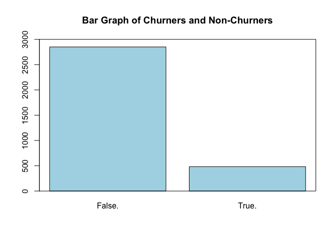

### MAKE A TABLE FOR COUNTS OF CHURN AND INTERNATIONAL PLAN

```r
  counts <- table(churn$Churn, churn$Int.l.Plan, dnn=c("Churn", "International Plan"))
  counts
```

```
##         International Plan
## Churn      no  yes
##   False. 2664  186
##   True.   346  137
```

### OVERLAYED BAR CHART

```r
  barplot(counts, legend = rownames(counts), col = c("blue", "red"),
          ylim = c(0, 3300), ylab = "Count", xlab = "International Plan",
          main = "Comparison Bar Chart: Churn Proportions by International Plan")
  box(which = "plot", lty = "solid", col="black")
```

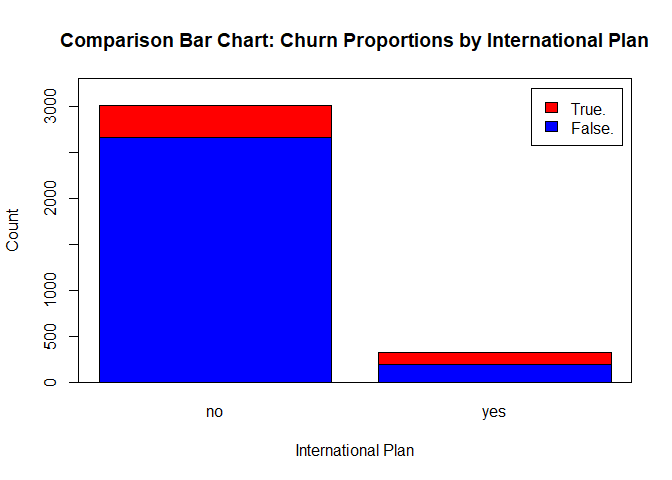

### CREATE A TABLE WITH SUMS FOR BOTH VARIABLES

```r
  sumtable <- addmargins(counts, FUN = sum)
```

```
## Margins computed over dimensions
## in the following order:
## 1: Churn
## 2: International Plan
```

```r
  sumtable
```

```
##         International Plan
## Churn      no  yes  sum
##   False. 2664  186 2850
##   True.   346  137  483
##   sum    3010  323 3333
```

### CREATE A TABLE OF PROPORTIONS OVER ROWS

```r
  row.margin <- round(prop.table(counts, margin = 1), 4)*100
  row.margin
```

```
##         International Plan
## Churn       no   yes
##   False. 93.47  6.53
##   True.  71.64 28.36
```

### CREATE A TABLE OF PROPORTIONS OVER COLUMNS

```r
  col.margin <- round(prop.table(counts, margin = 2), 4)*100
  col.margin
```

```
##         International Plan
## Churn       no   yes
##   False. 88.50 57.59
##   True.  11.50 42.41
```

### CLUSTERED BAR CHART, WITH LEGEND

```r
  barplot(counts, col = c("blue", "red"), ylim = c(0, 3300),
          ylab = "Count", xlab = "International Plan",
          main = "Churn Count by International Plan", beside = TRUE)
  legend("topright", c(rownames(counts)), col = c("blue", "red"),
         pch = 15, title = "Churn")
  box(which = "plot", lty = "solid", col="black")
```

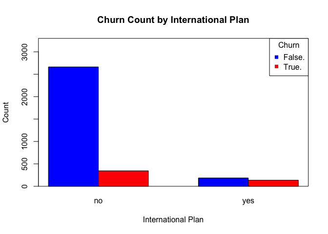

### CLUSTERED BAR CHART OF CHURN AND INTERNATIONAL PLAN WITH LEGEND

```r
  barplot(t(counts), col = c("blue", "green"), ylim = c(0, 3300),
          ylab = "Counts", xlab = "Churn",
          main = "International Plan Count by Churn", beside = TRUE)
  legend("topright", c(rownames(counts)), col = c("blue", "green"),
         pch = 15, title = "Int'l Plan")
  box(which = "plot", lty = "solid", col="black")
```

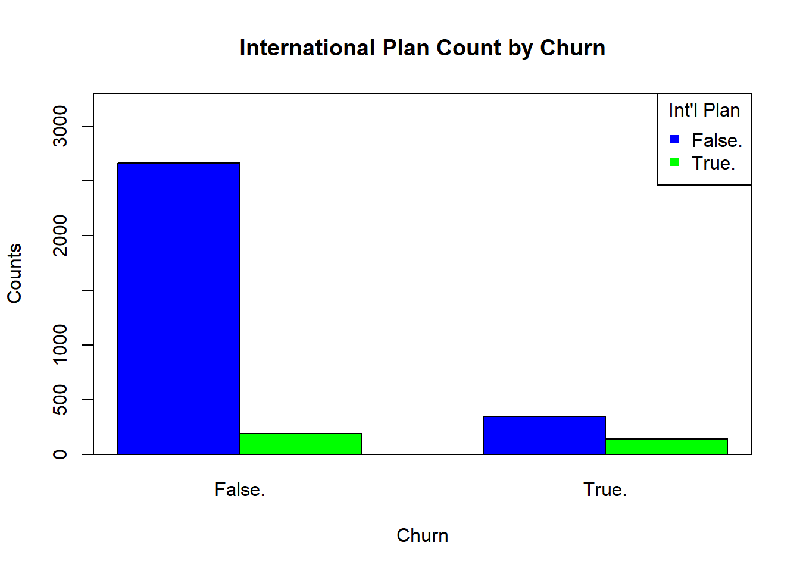

### HISTOGRAM OF NON-OVERLAYED CUSTOMER SERVICE CALLS

```r
  hist(churn$CustServ.Calls, xlim = c(0,10),
       col = "lightblue", ylab = "Count", xlab = "Customer Service Calls",
       main = "Histogram of Customer Service Calls")
```

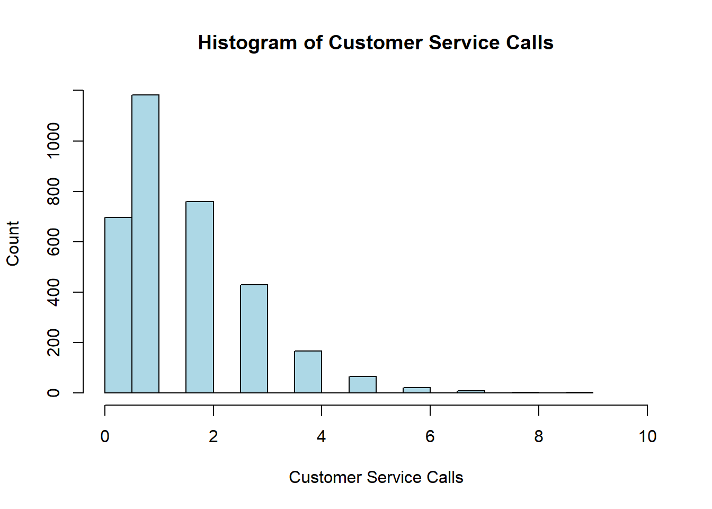

### DOWNLOAD AND INSTALL THE R PACKAGE GGPLOT2

```r
  #install.packages("ggplot2")
  # Pick any CRAN mirror
  # (see example image)
  # Open the new package
  library(ggplot2)            
```

```
## Warning: package 'ggplot2' was built under R version 3.5.2
```

```r
  # OVERLAYED BAR CHARTS
  ggplot() +
    geom_bar(data = churn,
             aes(x = factor(churn$CustServ.Calls),
                 fill = factor(churn$Churn)),
             position = "stack") +
    scale_x_discrete("Customer Service Calls") +
    scale_y_continuous("Percent") +
    guides(fill=guide_legend(title="Churn")) +
    scale_fill_manual(values=c("blue", "red"))
```

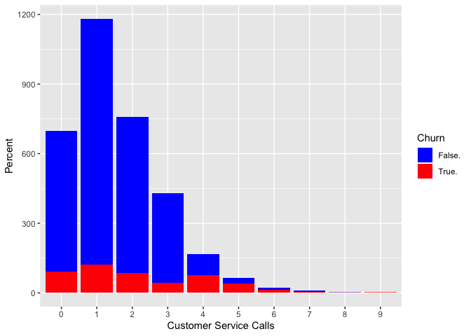

```r
  ggplot() +
    geom_bar(data=churn,
             aes(x = factor(churn$CustServ.Calls),
                 fill = factor(churn$Churn)),
             position = "fill") +
    scale_x_discrete("Customer Service Calls") +
    scale_y_continuous("Percent") +
    guides(fill=guide_legend(title="Churn")) +
    scale_fill_manual(values=c("blue", "red"))
```

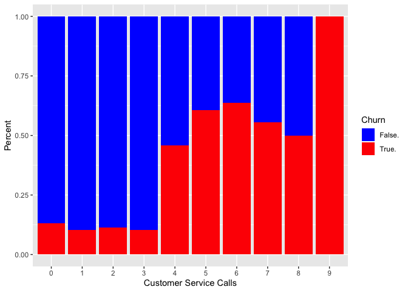

### TWO-SAMPLE T-TEST FOR INT'L CALLS

```r
  # Partition data
  churn.false <- subset(churn, churn$Churn == "False.")
  churn.true <- subset(churn, churn$Churn == "True.")
  
  # Run the test
  t.test(churn.false$Intl.Calls, churn.true$Intl.Calls)
```

```
## 
## 	Welch Two Sample t-test
## 
## data:  churn.false$Intl.Calls and churn.true$Intl.Calls
## t = 2.9604, df = 640.64, p-value = 0.003186
## alternative hypothesis: true difference in means is not equal to 0
## 95 percent confidence interval:
##  0.1243807 0.6144620
## sample estimates:
## mean of x mean of y 
##  4.532982  4.163561
```

### SCATTERPLOT OF EVENING MINUTES AND DAY MINUTES, COLORED BY CHURN

```r
  plot(churn$Eve.Mins, churn$Day.Mins,
       xlim = c(0, 400), ylim = c(0, 400),
       xlab = "Evening Minutes", ylab = "Day Minutes",
       main = "Scatterplot of Day and Evening Minutes by Churn",
       col = ifelse(churn$Churn== "True", "red", "blue"))
  legend("topright", c("True", "False"),
         col = c("red", "blue"), pch = 1, title = "Churn")
```

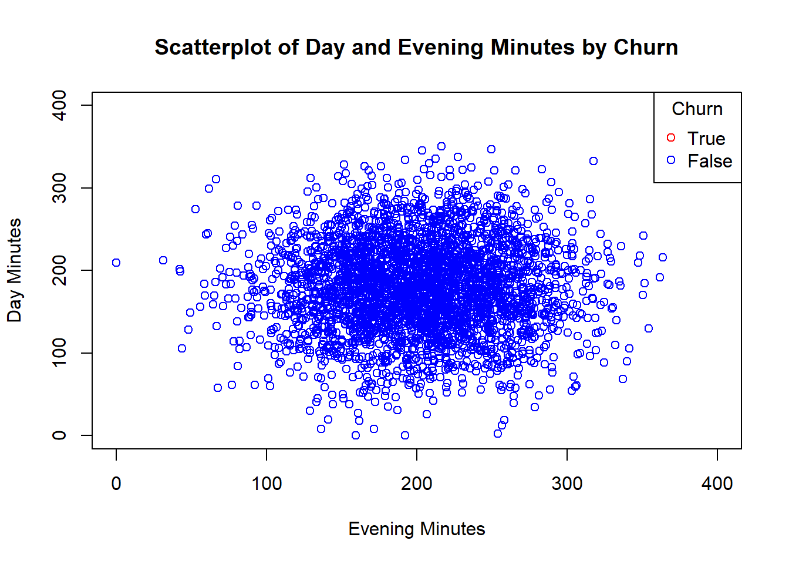

### SCATTERPLOT OF DAY MINUTES AND CUSTOMER SERVICE CALLS, COLORED BY CHURN

```r
  plot(churn$Day.Mins, churn$CustServ.Calls, xlim = c(0, 400),
       xlab = "Day Minutes", ylab = "Customer Service Calls",
       main = "Scatterplot of Day Minutes and Customer Service Calls by Churn",
       col = ifelse(churn$Churn=="True", "red", "blue"),
       pch = ifelse(churn$Churn=="True", 16, 20))
  legend("topright", c("True", "False"),
         col = c("red", "blue"), pch = c(16, 20), title = "Churn")
```

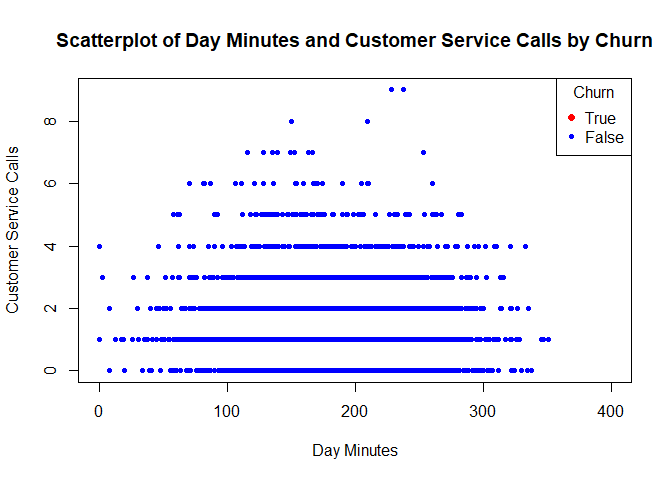

### SCATTERPLOT MATRIX

```r
  pairs(~churn$Day.Mins + churn$Day.Calls + churn$Day.Charge)
```

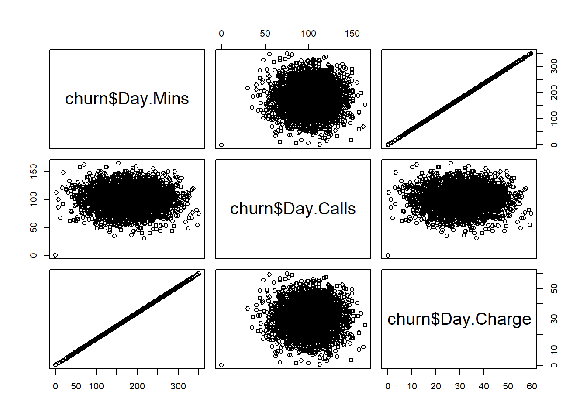

### REGRESSION OF DAY CHARGE VS DAY MINUTES

```r
  fit <- lm(churn$Day.Charge ~ churn$Day.Mins)
  summary(fit)
```

```
## 
## Call:
## lm(formula = churn$Day.Charge ~ churn$Day.Mins)
## 
## Residuals:
##        Min         1Q     Median         3Q        Max 
## -0.0045935 -0.0025391  0.0004326  0.0024587  0.0045224 
## 
## Coefficients:
##                 Estimate Std. Error   t value Pr(>|t|)    
## (Intercept)    6.134e-04  1.711e-04 3.585e+00 0.000341 ***
## churn$Day.Mins 1.700e-01  9.108e-07 1.866e+05  < 2e-16 ***
## ---
## Signif. codes:  0 '***' 0.001 '**' 0.01 '*' 0.05 '.' 0.1 ' ' 1
## 
## Residual standard error: 0.002864 on 3331 degrees of freedom
## Multiple R-squared:      1,	Adjusted R-squared:      1 
## F-statistic: 3.484e+10 on 1 and 3331 DF,  p-value: < 2.2e-16
```

### CORRELATION VALUES, WITH P-VALUES

```r
  days <- cbind(churn$Day.Mins, churn$Day.Calls, churn$Day.Charge)
  MinsCallsTest <- cor.test(churn$Day.Mins, churn$Day.Calls)
  MinsChargeTest <- cor.test(churn$Day.Mins, churn$Day.Charge)
  CallsChargeTest <- cor.test(churn$Day.Calls, churn$Day.Charge)
  round(cor(days), 4)
```

```
##        [,1]   [,2]   [,3]
## [1,] 1.0000 0.0068 1.0000
## [2,] 0.0068 1.0000 0.0068
## [3,] 1.0000 0.0068 1.0000
```

```r
  MinsCallsTest$p.value
```

```
## [1] 0.6968515
```

```r
  MinsChargeTest$p.value
```

```
## [1] 0
```

```r
  CallsChargeTest$p.value
```

```
## [1] 0.6967428
```

### CORRELATION VALUES AND P-VALUES IN MATRIX FORM

```r
  # Collect variables of interest
  corrdata <-
    cbind(churn$Account.Length, churn$VMail.Message, churn$Day.Mins, churn$Day.Calls, churn$CustServ.Calls)
  
  # Declare the matrix
  corrpvalues <- matrix(rep(0, 25), ncol = 5)
  
  # Fill the matrix with correlations
  for (i in 1:4) {
    for (j in (i+1):5) {
      corrpvalues[i,j] <-
        corrpvalues[j,i] <-
        round(cor.test(corrdata[,i],
                       corrdata[,j])$p.value,
              4)
    }
  }
  round(cor(corrdata), 4)
```

```
##         [,1]    [,2]    [,3]    [,4]    [,5]
## [1,]  1.0000 -0.0046  0.0062  0.0385 -0.0038
## [2,] -0.0046  1.0000  0.0008 -0.0095 -0.0133
## [3,]  0.0062  0.0008  1.0000  0.0068 -0.0134
## [4,]  0.0385 -0.0095  0.0068  1.0000 -0.0189
## [5,] -0.0038 -0.0133 -0.0134 -0.0189  1.0000
```

```r
  corrpvalues
```

```
##        [,1]   [,2]   [,3]   [,4]   [,5]
## [1,] 0.0000 0.7894 0.7198 0.0264 0.8266
## [2,] 0.7894 0.0000 0.9642 0.5816 0.4440
## [3,] 0.7198 0.9642 0.0000 0.6969 0.4385
## [4,] 0.0264 0.5816 0.6969 0.0000 0.2743
## [5,] 0.8266 0.4440 0.4385 0.2743 0.0000
```

# Chapter 4
  
### READ IN THE HOUSES DATASET AND PREPARE THE DATA

```r
  setwd("~/IMGT680")
  houses <- read.csv(file="houses.csv", stringsAsFactors = FALSE, header = FALSE)
  names(houses) <- c("MVAL", "MINC", "HAGE", "ROOMS", "BEDRMS", "POPN", "HHLDS", "LAT", "LONG")
  
  # Standardize the variables
  houses$MINC_Z <- (houses$MINC - mean(houses$MINC))/(sd(houses$MINC))
  houses$HAGE_Z <- (houses$HAGE - mean(houses$HAGE))/(sd(houses$HAGE))
  houses$ROOMS_Z <- (houses$ROOMS - mean(houses$ROOMS))/(sd(houses$ROOMS))
  houses$BEDRMS_Z <- (houses$BEDRMS - mean(houses$BEDRMS))/(sd(houses$BEDRMS))
  houses$POPN_Z <- (houses$POPN - mean(houses$POPN))/(sd(houses$POPN))
  houses$HHLDS_Z <- (houses$HHLDS - mean(houses$HHLDS))/(sd(houses$HHLDS))
  houses$LAT_Z <- (houses$LAT - mean(houses$LAT))/(sd(houses$LAT))
  houses$LONG_Z <- (houses$LONG - mean(houses$LONG))/(sd(houses$LONG))
  
  # Randomly select 90% for the Training dataset
  choose <- runif(dim(houses)[1],0, 1)
  test.house <- houses[which(choose < .1),]
  train.house <- houses[which(choose <= .1),]
```

### PRINCIPAL COMPONENT ANALYSIS

```r
  # Requires library "psych"
  #install.packages("psych")
  library(psych)
```

```
## Warning: package 'psych' was built under R version 3.5.2
```

```
## 
## Attaching package: 'psych'
```

```
## The following objects are masked from 'package:ggplot2':
## 
##     %+%, alpha
```

```r
  pca1 <- principal(train.house[,c(10:17)], nfactors=8, rotate="none", scores=TRUE)
```

### PCA RESULTS

```r
  # Eigenvalues:
  pca1$values
```

```
## [1] 3.91946609 1.90215878 1.06117981 0.83598751 0.14120819 0.08029053
## [7] 0.04477050 0.01493858
```

```r
  # Loadings matrix,
  # variance explained,
  pca1$loadings
```

```
## 
## Loadings:
##          PC1    PC2    PC3    PC4    PC5    PC6    PC7    PC8   
## MINC_Z                  0.936  0.343                            
## HAGE_Z   -0.424        -0.377  0.823                            
## ROOMS_Z   0.958  0.101         0.103  0.155  0.118 -0.125       
## BEDRMS_Z  0.974        -0.112         0.126                     
## POPN_Z    0.938        -0.104        -0.308                     
## HHLDS_Z   0.974        -0.101               -0.116              
## LAT_Z    -0.133  0.971                       0.146              
## LONG_Z    0.147 -0.968                       0.148              
## 
##                  PC1   PC2   PC3   PC4   PC5   PC6   PC7   PC8
## SS loadings    3.919 1.902 1.061 0.836 0.141 0.080 0.045 0.015
## Proportion Var 0.490 0.238 0.133 0.104 0.018 0.010 0.006 0.002
## Cumulative Var 0.490 0.728 0.860 0.965 0.983 0.993 0.998 1.000
```

### SCREE PLOT

```r
  plot(pca1$values, type = "b", main = "Scree Plot for Houses Data")
```

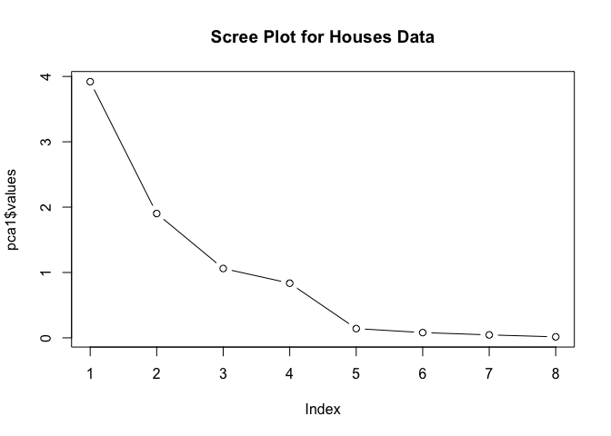

### PLOT FACTOR SCORES

```r
  pairs(~train.house$MINC + train.house$HAGE+pca1$scores[,3],
         labels = c("Median Income", "Housing Median Age", "Component 3 Scores"))
```


```r
  pairs(~train.house$MINC + train.house$HAGE+pca1$scores[,4],
         labels = c("Median Income", "Housing Median Age", "Component 4 Scores"))
```

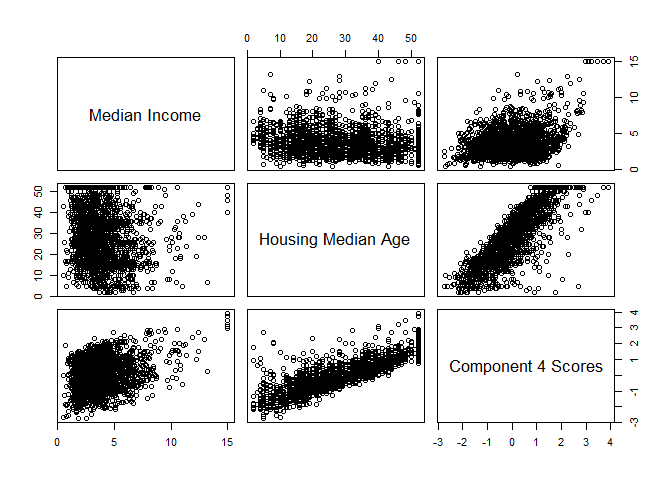

### CALCULATE COMMUNALITIES

```r
  comm3 <- loadings(pca1)[2,1]^2 + loadings(pca1)[2,2]^2 + loadings(pca1)[2,3]^2
  comm4 <- loadings(pca1)[2,1]^2 + loadings(pca1)[2,2]^2+ loadings(pca1)[2,3]^2 + loadings(pca1)[2,4]^2
  comm3; comm4
```

```
## [1] 0.3223259
```

```
## [1] 0.9990252
```

### VALIDATION OF THE PRINCIPAL COMPONENTS

```r
  pca2 <- principal(test.house[,c(10:17)], nfactors=4, rotate="none", scores=TRUE)
  pca2$loadings
```

```
## 
## Loadings:
##          PC1    PC2    PC3    PC4   
## MINC_Z                  0.936  0.343
## HAGE_Z   -0.424        -0.377  0.823
## ROOMS_Z   0.958  0.101         0.103
## BEDRMS_Z  0.974        -0.112       
## POPN_Z    0.938        -0.104       
## HHLDS_Z   0.974        -0.101       
## LAT_Z    -0.133  0.971              
## LONG_Z    0.147 -0.968              
## 
##                  PC1   PC2   PC3   PC4
## SS loadings    3.919 1.902 1.061 0.836
## Proportion Var 0.490 0.238 0.133 0.104
## Cumulative Var 0.490 0.728 0.860 0.965
```

### READ IN AND PREPARE DATA FOR FACTOR ANALYSIS

```r
  setwd("~/IMGT680")
  adult <- read.csv(file="adult.txt", stringsAsFactors = FALSE)
  adult$"capnet"<- adult$capital.gain-adult$capital.loss
  adult.s <- adult[,c(1,3,5,13,16)]

  # Standardize the data:
  adult.s$AGE_Z <- (adult.s$age - mean(adult.s$age))/(sd(adult.s$age))
  adult.s$DEM_Z <- (adult.s$demogweight - mean(adult.s$demogweight))/(sd(adult.s$demogweight))
  adult.s$EDUC_Z <- (adult.s$education.num - mean(adult.s$education.num))/(sd(adult.s$education.num))
  adult.s$CAPNET_Z <- (adult.s$capnet - mean(adult.s$capnet))/(sd(adult.s$capnet))
  adult.s$HOURS_Z <- (adult.s$hours.per.week - mean(adult.s$hours.per.week))/(sd(adult.s$hours.per.week))
  
  # Randomly select a Training dataset
  choose <- runif(dim(adult.s)[1],0, 1)
  test.adult <- adult.s[which(choose < .1), c(6:10)]
  train.adult <- adult.s[which(choose >= .1), c(6:10)]
```

### BARTLETT'S TEST FOR SPHERICITY

```r
  # Requires package psych
  library(psych)
  corrmat1 <- cor(train.adult, method = "pearson")
  cortest.bartlett(corrmat1, n = dim(train.adult)[1])
```

```
## $chisq
## [1] 1248.566
## 
## $p.value
## [1] 4.802611e-262
## 
## $df
## [1] 10
```

### FACTOR ANALYSIS WITH FIVE COMPONENTS

```r
  # Requires psych, GPArotation
  #install.packages("GPArotation")
  library(GPArotation)
  fa1 <- fa(train.adult, nfactors=5, fm = "pa", rotate="none", SMC=FALSE)
```

```
## Warning in fac(r = r, nfactors = nfactors, n.obs = n.obs, rotate =
## rotate, : An ultra-Heywood case was detected. Examine the results carefully
```

```r
  fa1$values # Eigenvalues
```

```
## [1] 1.2787980 1.0292523 0.9528561 0.9129525 0.8261412
```

```r
  fa1$loadings # Loadings, proportion of variance, and cumulative variance
```

```
## 
## Loadings:
##          PA1    PA2    PA3    PA4    PA5   
## AGE_Z     0.423 -0.495  0.631  0.312  0.284
## DEM_Z    -0.231  0.794  0.409  0.299  0.246
## EDUC_Z    0.633  0.205 -0.400 -0.162  0.609
## CAPNET_Z  0.541  0.278  0.412 -0.585 -0.344
## HOURS_Z   0.595  0.189 -0.239  0.599 -0.442
## 
##                  PA1   PA2   PA3   PA4   PA5
## SS loadings    1.279 1.029 0.953 0.913 0.826
## Proportion Var 0.256 0.206 0.191 0.183 0.165
## Cumulative Var 0.256 0.462 0.652 0.835 1.000
```

### FACTOR ANALYSIS WITH TWO COMPONENTS

```r
  fa2 <- fa(train.adult, nfactors=2, fm = "pa", max.iter = 200, rotate="none")
  fa2$values # Eigenvalues
```

```
## [1]  0.511437307  0.326983070  0.034352798 -0.004083564 -0.031265453
```

```r
  fa2$loadings # Loadings
```

```
## 
## Loadings:
##          PA1    PA2   
## AGE_Z     0.519 -0.377
## DEM_Z    -0.109       
## EDUC_Z    0.352  0.382
## CAPNET_Z  0.216  0.117
## HOURS_Z   0.245  0.157
## 
##                  PA1   PA2
## SS loadings    0.511 0.327
## Proportion Var 0.102 0.065
## Cumulative Var 0.102 0.168
```

```r
  fa2$communality # Communality
```

```
##      AGE_Z      DEM_Z     EDUC_Z   CAPNET_Z    HOURS_Z 
## 0.41148485 0.01233267 0.26941045 0.06024223 0.08495018
```

### VARIMAX ROTATION

```r
  fa2v <- fa(train.adult, nfactors = 2, fm = "pa", max.iter = 200, rotate="varimax")
  fa2v$loadings
```

```
## 
## Loadings:
##          PA1    PA2   
## AGE_Z     0.640       
## DEM_Z                 
## EDUC_Z           0.518
## CAPNET_Z         0.228
## HOURS_Z          0.278
## 
##                  PA1   PA2
## SS loadings    0.435 0.403
## Proportion Var 0.087 0.081
## Cumulative Var 0.087 0.168
```

```r
  fa2v$communality
```

```
##      AGE_Z      DEM_Z     EDUC_Z   CAPNET_Z    HOURS_Z 
## 0.41148485 0.01233267 0.26941045 0.06024223 0.08495018
```

### USER-DEFINED COMPOSITES

```r
  small.houses <- houses[,c(4:7)]
  a <- c(1/4, 1/4, 1/4, 1/4)
  W <- t(a)*small.houses
```

# Chapter 7
  
### READ IN THE DATA, PARTITION TRAINING AND TESTING DATA

```r
  setwd("~/IMGT680")
  adult <- read.csv(file = "adult.txt", stringsAsFactors=TRUE)
  choose <- runif(length(adult$income), min = 0, max = 1)
  training <- adult[choose <= 0.75,]
  testing <- adult[choose > 0.75,]
  adult[1:5, c(1,2,3)]
```

```
##   age        workclass demogweight
## 1  39        State-gov       77516
## 2  50 Self-emp-not-inc       83311
## 3  38          Private      215646
## 4  53          Private      234721
## 5  28          Private      338409
```

```r
  training[1:5, c(1,2,3)]
```

```
##   age        workclass demogweight
## 1  39        State-gov       77516
## 2  50 Self-emp-not-inc       83311
## 4  53          Private      234721
## 5  28          Private      338409
## 6  37          Private      284582
```

```r
  testing[1:5, c(1,2,3)] 
```

```
##    age workclass demogweight
## 3   38   Private      215646
## 9   31   Private       45781
## 12  30 State-gov      141297
## 13  23   Private      122272
## 14  32   Private      205019
```

### REMOVE THE TARGET VARIABLE, INCOME, FROM THE TESTING DATA

```r
  names(testing)
```

```
##  [1] "age"            "workclass"      "demogweight"    "education"     
##  [5] "education.num"  "marital.status" "occupation"     "relationship"  
##  [9] "race"           "sex"            "capital.gain"   "capital.loss"  
## [13] "hours.per.week" "native.country" "income"
```

```r
  # Target variable is in Column 15
  testing <- testing[,-15]
  names(testing)
```

```
##  [1] "age"            "workclass"      "demogweight"    "education"     
##  [5] "education.num"  "marital.status" "occupation"     "relationship"  
##  [9] "race"           "sex"            "capital.gain"   "capital.loss"  
## [13] "hours.per.week" "native.country"
```

```r
  # Target variable is no longer in the testing data
```

### REMOVE THE PARTITIONING VARIABLE, PART, FROM BOTH DATA SETS

```r
  # Part is now the 15th variable
  testing <- testing[,-15]
  names(testing)
```

```
##  [1] "age"            "workclass"      "demogweight"    "education"     
##  [5] "education.num"  "marital.status" "occupation"     "relationship"  
##  [9] "race"           "sex"            "capital.gain"   "capital.loss"  
## [13] "hours.per.week" "native.country"
```

```r
  names(training)
```

```
##  [1] "age"            "workclass"      "demogweight"    "education"     
##  [5] "education.num"  "marital.status" "occupation"     "relationship"  
##  [9] "race"           "sex"            "capital.gain"   "capital.loss"  
## [13] "hours.per.week" "native.country" "income"
```

```r
  # Part is the 16th variable in the training data set
  training <- training[,-16]
  names(training)
```

```
##  [1] "age"            "workclass"      "demogweight"    "education"     
##  [5] "education.num"  "marital.status" "occupation"     "relationship"  
##  [9] "race"           "sex"            "capital.gain"   "capital.loss"  
## [13] "hours.per.week" "native.country" "income"
```
